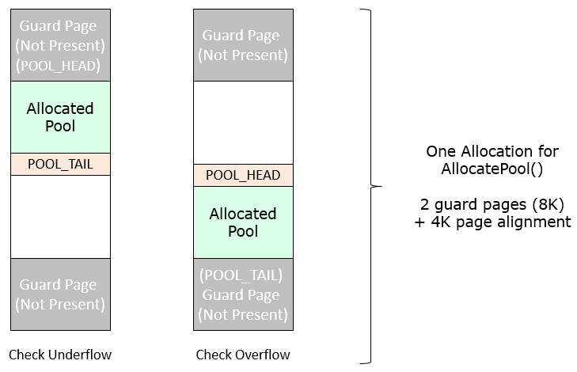

# Project Mu Memory Protection

- [Project Mu Memory Protection](#project-mu-memory-protection)
  - [Introduction and Primer](#introduction-and-primer)
    - [UEFI Paging Protection Attributes](#uefi-paging-protection-attributes)
      - [EFI\_MEMORY\_RP](#efi_memory_rp)
      - [EFI\_MEMORY\_RO](#efi_memory_ro)
      - [EFI\_MEMORY\_XP](#efi_memory_xp)
    - [Enhanced Memory Protection and Compatibility Mode](#enhanced-memory-protection-and-compatibility-mode)
  - [Available Memory Protection Settings](#available-memory-protection-settings)
    - [Null Pointer Detection](#null-pointer-detection)
    - [Read Protection on Free Memory](#read-protection-on-free-memory)
    - [Image Protection Policy](#image-protection-policy)
    - [XN/NX Memory Protection Policy](#xnnx-memory-protection-policy)
    - [Page Guards](#page-guards)
    - [Pool Guards](#pool-guards)
    - [Heap Guard Policy](#heap-guard-policy)
    - [CPU Stack Guard](#cpu-stack-guard)
    - [Stack Cookies](#stack-cookies)
  - [How to Set the Memory Protection Policy](#how-to-set-the-memory-protection-policy)
  - [Memory Protection Special Regions](#memory-protection-special-regions)
    - [Example Declaration of Special Region in PEI](#example-declaration-of-special-region-in-pei)
    - [Example Declaration of Special Region in DXE](#example-declaration-of-special-region-in-dxe)
  - [Debugging](#debugging)
    - [Example 1](#example-1)
    - [Example 2](#example-2)

## Introduction and Primer

The Project Mu Memory Protection Settings add safety functionality such as page and pool guards,
stack guard, and null pointer detection. The settings are split between MM and DXE environments
for modularity.

### UEFI Paging Protection Attributes

There are 3 UEFI attributes which are manipulated to apply the protections described in this
document. Each UEFI attribute corresponds to some number of architecture specific bits on
either ARM or x86 silicon.

#### EFI_MEMORY_RP

This EFI attribute manipulates the writeable and readable attributes of a page. When set,
the memory is read-protected.

#### EFI_MEMORY_RO

This EFI attribute manipulates writeable attribute of a page. When set, the
memory is read-only.

#### EFI_MEMORY_XP

This EFI attribute manipulates execute attribute of a page. When set, the memory is
non-executable. In order for this attribute to work, architecture-specific register
configuration bits must be set properly. For example, on x86 the IA32_EFER.NXE bit in
the IA32_EFER MSR register must be set.

### Enhanced Memory Protection and Compatibility Mode

Microsoft has defined a set of paging protections which will be required for UEFI
distributions booting Windows (Enhanced Memory Protections). Microsoft also defined
Compatibility Mode which is a reduced security state suitable for legacy option
ROMs and older Linux distributions. The specifics of these two modes are detailed
in the
[Project Mu documentation](https://microsoft.github.io/mu/WhatAndWhy/enhancedmemoryprotection/).

## Available Memory Protection Settings

### Null Pointer Detection

Pages are allocated in 4KB chunks (UEFI Spec Required). This policy sets the attributes of the
4KB page at the NULL address to [EFI_MEMORY_RP](#efi_memory_rp) to detect NULL pointer
dereferences in DXE and/or platform MM.

The **DXE environment** has the following settings available:

- **UefiNullDetection**: Enable NULL pointer detection for DXE.
- **DisableEndOfDxe**: Disable NULL pointer detection just after the end of DXE protocol
is installed.
- **DisableReadyToBoot**: Disable NULL pointer detection just after the ready to boot
protocol is installed.

DisableEndOfDxe and DisableReadyToBoot are provided to deal with problematic legacy
drivers, option ROMs, and bootloaders which may access memory below 4KB such as older
linux distros.

The **MM environment** only has a single option indicating whether NULL detection
is active or not.

### Read Protection on Free Memory

If enabled, all EfiConventionalMemory (free memory) will be marked with the
[EFI_MEMORY_RP](#efi_memory_rp) attribute. This policy will cause accesses to uanallocated
or freed memory to trigger a page fault and target one of the most common programmer errors.
This can be used in conjunction with the NX setting for EfiConventionalMemory.

### Image Protection Policy

This policy enables a loaded EFI image to have [EFI_MEMORY_XP](#efi_memory_xp) to its
DATA sections and [EFI_MEMORY_RO](#efi_memory_ro) to its CODE sections. Loaded EFI
images must adhere to the following rules for this policy to work:

1. The PE code section and data sections are not merged.
2. The PE image sections must be page aligned.
3. A platform may not disable XN (AARCH64)/NX (X86_X64) in the
configuration registers in the DXE phase.
4. CODE sections must not be self-modifying
5. Modules of type DXE_RUNTIME_DRIVER must have their section alignment set to
RUNTIME_PAGE_ALLOCATION_GRANULARITY which may differ from EFI_PAGE_SIZE. File
alignment can still be EFI_PAGE_SIZE.

This policy **only applies to DXE**.

- **FromFv**: Protect images from firmware volumes.
- **FromUnknown**: Protect images not from firmware volumes.
- **RaiseErrorIfProtectionFails**: If set, images which fail to be protected will be
unloaded which will trigger an ASSERT on DEBUG builds. An image will still be loaded
if it follows the above rules but was loaded before the CPU Arch Protocol was installed.
Images loaded before the CPU Arch Protocol was installed will be protected when the
protocol is installed.
- **BlockImagesWithoutNxFlag**: Images which do not have the NX_COMPAT DLL characteristic
set will be blocked from loading and trigger an ASSERT on DEBUG builds. If this is set to
FALSE, images without the NX_COMPAT DLL characteristic will still be loaded but will trigger
Compatibility Mode. See
[Enhanced Memory Protection and Compatibility Mode](#enhanced-memory-protection-and-compatibility-mode)
for more information.

### XN/NX Memory Protection Policy

This policy applies [EFI_MEMORY_XP](#efi_memory_xp) to memory of the
associated memory type. **This policy only applies to DXE**

The available settings match the EFI memory types as well as the OEMReserved
and OSReserved regions defined in the UEFI specification.

### Page Guards

The HeapGuardPageType policy implements guard pages on the specified memory types
to detect heap overflow. If a bit is set, a guard page will be added before and
after the corresponding type of page allocated if there's enough free pages for
all of them. Guard pages are set to [EFI_MEMORY_RP](#efi_memory_rp) so any attempt
to access them will cause a page fault. The system will do its best to ensure
that only one guard page separates two allocated pages to avoid wasted space.

The available settings match the EFI memory types as well as the OEMReserved
and OSReserved regions defined in the UEFI specification.

### Pool Guards

The HeapGuardPoolType policy is essentially the same as HeapGuardPageType policy.
For each active memory type, a guard page with the [EFI_MEMORY_RP](#efi_memory_rp) attribute
will be added just before and after the portion of memory which the
allocated pool occupies. The only added complexity comes when the allocated pool is not a
multiple of the size of a page. In this case, the pool must align with either the head or tail
guard page, meaning either overflow or underflow can be caught consistently but not both.
The head/tail alignment is set in [Heap Guard Policy](#heap-guard-policy).

The available settings match the EFI memory types as well as the OEMReserved
and OSReserved regions defined in the UEFI specification.

### Heap Guard Policy

While the above two policies ([Pool Guards](#pool-guards) and [Page Guards](#page-guards))
act as a switch for each memory type, this policy is an enable/disable
switch for those two policies. For example, if UefiPageGuard is unset then page guards are
inactive regardless of the individual [Page Guard](#page-guards) settings.

The only aspect of this policy which should be elaborated upon is Direction.
Direction dictates whether an allocated pool which does not fit perfectly into a
multiple of pages is aligned to the head or tail guard. The following Figure shows
examples of the two:



On free the pool head/tail is checked to ensure it was not overwritten while the
[EFI_MEMORY_RP](#efi_memory_rp) page will trigger a page fault immediately.

The **DXE environment** has the following settings available:

- **UefiPageGuard**: Enable UEFI page guard
- **UefiPoolGuard**: Enable UEFI pool guard
- **Direction**: Specifies the direction of Guard Page for Pool Guard. If 0, the returned
pool is near the tail guard page. If 1, the returned pool is near the head guard page. The
default value for this is 0

The **MM environment** has the following settings available:

- **SmmPageGuard**: Enable SMM page guard
- **SmmPoolGuard**: Enable SMM pool guard
- **Direction**: Specifies the direction of Guard Page for Pool Guard. If 0, the returned
pool is near the tail guard page. If 1, the returned pool is near the head guard page. The
default value for this is 0

### CPU Stack Guard

CPU Stack Guard adds two additional pages to the stack base for each core. The first page is
simply a guard page with the [EFI_MEMORY_RP](#efi_memory_rp) attribute. When a page fault
occurs, the current stack address is invalid and so it is not possible to push the error
code and architecture status onto the current stack. Because of this, there is a special
"Exception Stack" or "Known Good Stack" which is the second page placed at the base
of the stack. This page is reserved for use by the exception handler and ensures that a
valid stack is always present when an exception occurs for error reporting.

**A note on SMM:** An equivalent SMM stack guard feature is contained in
UefiCpuPkg/PiSmmCpuDxeSmm and is not dictated by this policy.

**Note that the UEFI:** stack protection starts in DxeIpl, because the region is fixed,
and requires PcdDxeIplBuildPageTables to be TRUE. In Project Mu, we have hard-coded CpuStackGuard
to be TRUE in PEI phase, so we always set up a switch stack and guard page in PEI. However,
the stack switch handlers will still only be installed in DXE phase if CpuStackGuard is TRUE.
If the stack guard is disabled in DXE, the paging attributes at the stack base will be
removed during memory protection initialization.

### Stack Cookies

A stack cookie (also called stack canary) is an integer placed in memory just before the stack
return pointer. Most buffer overflows overwrite memory from lower to higher memory addresses,
so in order to overwrite the return pointer (and thus take control of the process) the canary
value must also be overwritten. This value is checked to make sure it has not changed before a
routine uses the return pointer on the stack.

The stack cookie value is specific to each loaded image and is generated at random on image
load in DXE. Stack cookies are enabled at compile time via `/GS` on MSVC toolchains and
`-fstack-protector` on GCC/Clang, but if this setting is FALSE the interrupts generated by
stack cookie check failures will be ignored **which is extremely unsafe**. Stack cookie failures
will trigger a warm reset if this policy is TRUE.

For more information on stack cookie support in Project Mu, see the
[StackCheckLib documentation](https://github.com/microsoft/mu_basecore/tree/HEAD/MdePkg/Library/StackCheckLib/Readme.md)

## How to Set the Memory Protection Policy

For DXE settings, add the following to the platform DSC file:

```text
[LibraryClasses.Common.DXE_DRIVER, LibraryClasses.Common.DXE_CORE, LibraryClasses.Common.UEFI_APPLICATION]
  DxeMemoryProtectionHobLib|MdeModulePkg/Library/MemoryProtectionHobLib/DxeMemoryProtectionHobLib.inf
```

For MM settings, add the following to the platform DSC file if the platform utilizes SMM:

```text
[LibraryClasses.common.SMM_CORE, LibraryClasses.common.DXE_SMM_DRIVER]
  MmMemoryProtectionHobLib|MdeModulePkg/Library/MemoryProtectionHobLib/SmmMemoryProtectionHobLib.inf
```

**or** the following if the platform utilizes Standalone MM:

```text
[LibraryClasses.common.MM_CORE_STANDALONE, LibraryClasses.common.MM_STANDALONE]
  MmMemoryProtectionHobLib|MdeModulePkg/Library/MemoryProtectionHobLib/StandaloneMmMemoryProtectionHobLib.inf
```

Create the HOB entry in any PEI module by adding the include:

```C
#include <Guid/DxeMemoryProtectionSettings.h>
#include <Guid/MmMemoryProtectionSettings.h>
```

and somewhere within the code doing something like:

```C
  DXE_MEMORY_PROTECTION_SETTINGS  DxeSettings;
  MM_MEMORY_PROTECTION_SETTINGS   MmSettings;

  DxeSettings = (DXE_MEMORY_PROTECTION_SETTINGS)DXE_MEMORY_PROTECTION_SETTINGS_DEBUG;
  MmSettings  = (MM_MEMORY_PROTECTION_SETTINGS)MM_MEMORY_PROTECTION_SETTINGS_DEBUG;

  BuildGuidDataHob (
    &gDxeMemoryProtectionSettingsGuid,
    &DxeSettings,
    sizeof (DxeSettings)
    );

  BuildGuidDataHob (
    &gMmMemoryProtectionSettingsGuid,
    &MmSettings,
    sizeof (MmSettings)
    );
```

This will also require you to add gMemoryProtectionSettingsGuid under the Guids section in the relevant INF.

If you want to deviate from one of the settings profile definitions in DxeMemoryProtectionSettings.h
and/or MmMemoryProtectionSettings, it is recommended
that you start with the one which most closely aligns with your desired settings and update from there in a
manner similar to below:

```C
  MmSettings.HeapGuardPolicy.Fields.MmPageGuard                    = 0;
  MmSettings.HeapGuardPolicy.Fields.MmPoolGuard                    = 0;
  DxeSettings.ImageProtectionPolicy.Fields.ProtectImageFromUnknown = 1;
```

before building the HOB.

## Memory Protection Special Regions

Memory protection is not activated until the CPU Architecture Protocol has been installed
because the protocol facilitates access to the attribute manipulation functions in CpuDxe
which update the translation/page tables. Many allocations and image loads will have occurred
by the time the protocol is published so careful accounting is required to ensure appropriate
attributes are applied. An event notification triggered on the CPU Architecture Protocol
installation will combine the GCD and EFI memory maps to create a full map of memory for use
internally by the memory protection initialization logic. Because image memory is allocated
for the entire image and not each section (code and data), the images are separated within
the combined map so NX can be applied to data regions and RO can be applied to code regions.
After breaking up the map so each DXE image section has its own descriptor, every non-image
descriptor will have its attributes set based on its EFI memory type. There are cases where
the platform will want to apply attributes to a region of memory which is different than what
would be applied based on its EFI memory type. In this case,

platforms can utilize the Memory Protection Special Region interface to specify regions
which should have specific attributes applied during memory protection initialization.

### Example Declaration of Special Region in PEI

```C
#include <Guid/MemoryProtectionSpecialRegionGuid.h>

MEMORY_PROTECTION_SPECIAL_REGION SpecialRegion;
SpecialRegion.Start       = 0x1000;
SpecialRegion.Length      = 0x1000;
SpecialRegion.Attributes  = EFI_MEMORY_RO;

BuildGuidDataHob (
    &gMemoryProtectionSpecialRegionHobGuid,
    &SpecialRegion,
    sizeof (SpecialRegion)
    );

```

### Example Declaration of Special Region in DXE

```C
#include <Protocol/MemoryProtectionSpecialRegionProtocol.h>

MEMORY_PROTECTION_SPECIAL_REGION_PROTOCOL *SpecialRegionProtocol = NULL;
EFI_PHYSICAL_ADDRESS  BufferStart       = 0x1000;
UINT64                BufferLength      = 0x1000;
UINT64                BufferAttributes  = EFI_MEMORY_RO;

Status = gBS->LocateProtocol (&gMemoryProtectionSpecialRegionProtocolGuid, NULL, (VOID **)&SpecialRegionProtocol);
ASSERT_EFI_ERROR (Status);
if (SpecialRegionProtocol != NULL) {
  Status = SpecialRegionProtocol->AddSpecialRegion (
                                    BufferStart,
                                    BufferLength,
                                    BufferAttributes
                                    );

  ASSERT_EFI_ERROR (Status);
}
```

These special regions also may be used during paging audit tests which check if the
page table has secure attributes. For example, an existing test checks to see if there
are any Read/Write/Execute memory regions and fail if true. During this test, if a
Read/Write/Execute region is found, it will be checked against the special regions
and a test failure will not be emitted if the page attributes are consistent with the
attributes identified in the overlapping special region.

## Debugging

After a page fault is triggered, it is time to debug what caused it. The following is
an example of debugging an x86 platform. The same principles apply to ARM platforms
though the register names and Assembly instructions will be different.

### Example 1

Page faults result in an exception message in UEFI, such as the example exception below:

```text
!!!! X64 Exception Type - 0E(#PF - Page-Fault)  CPU Apic ID - 00000000 !!!!
ExceptionData - 0000000000000002  I:0 R:0 U:0 W:1 P:0 PK:0 SS:0 SGX:0
RIP  - 000000007A5B100A, CS  - 0000000000000038, RFLAGS - 0000000000000206
RAX  - 0000000000000000, RCX - 0000000000000001, RDX - 000000007A127C00
RBX  - 00000000FFFFFFFF, RSP - 000000007EEDC5F0, RBP - 000000007A5CAFC8
RSI  - 000000007A5D2E98, RDI - 000000007A128000
R8   - 0000000000000000, R9  - 000000007CC24938, R10 - 000000007D0212A0
R11  - 0000000000000000, R12 - 0000000000000000, R13 - 0000000000000000
R14  - 000000000000017D, R15 - 0000000000000000
DS   - 0000000000000030, ES  - 0000000000000030, FS  - 0000000000000030
GS   - 0000000000000030, SS  - 0000000000000030
CR0  - 0000000080010033, CR2 - 000000007A128000, CR3 - 000000007EC01000
CR4  - 0000000000000668, CR8 - 0000000000000000
DR0  - 0000000000000000, DR1 - 0000000000000000, DR2 - 0000000000000000
DR3  - 0000000000000000, DR6 - 00000000FFFF0FF0, DR7 - 0000000000000400
GDTR - 000000007E50BF30 0000000000000057, LDTR - 0000000000000000
IDTR - 000000007D044000 0000000000000FFF,   TR - 0000000000000048
FXSAVE_STATE - 000000007E50B380
```

The exception information contains a dump of the register values of the CPU
that tripped the exception. One item to note is `CR2`, which is the Page Fault
Linear Address (PFLA) register. When a page fault occurs, `CR2` is filled with
the address that was accessed and triggered the page fault.

To help decipher the information, it is also helpful to have the following item:

- Debug Log from the system
- Access to the binary files
- Access to the build folders

From the exception information, find the RIP, which gives the memory address
that was being executed when the exception was triggered. In this case it is
`000000007A5B100A`.

From the debug log, find the driver associated with instruction pointer address.
This can usually be done by masking off the lower bits of the instruction pointer,
in this case looking for `7A5B0000` results in the line:

```text
Loading driver at 0x0007A5B0000 EntryPoint=0x0007A5B1160 MemoryFaultApp.efi
InstallProtocolInterface: BC62157E-3E33-4FEC-9920-2D3B36D750DF 7A5C6F88
ProtectUefiImageMu - 0x7A5D2EA0
   0x000000007A5B0000 - 0x000000000000C000
 CreateImagePropertiesRecord - Enter...
   Image: Build\QemuQ35Pkg\DEBUG_VS2022\X64\MemoryFaultApp\MemoryFaultApp\DEBUG\MemoryFaultApp.pdb
```

`7A5B100A - 7A5B0000 = 100A` which is the the offset within the image where the
page fault occurred.

If the driver binary is available, `dumpbin` can be helpful. Dumpbin is part
of Visual Studio and can be used to disassemble the executable to locate
the instruction which triggered the page fault. The command is:
`dumpbin.exe <application name> /disasm /out:outputfile.txt`

Note: If this is performed on the system where the PDB files still exist, the disassembly
will contain function names. Otherwise the disassembly will only contain Assembly code.

Without PDB Files:

```text
  0000000000001000: 57                 push        rdi
  0000000000001001: 4C 89 C0           mov         rax,r8
  0000000000001004: 48 89 CF           mov         rdi,rcx
  0000000000001007: 48 87 CA           xchg        rcx,rdx
  000000000000100A: F3 AA              rep stos    byte ptr [rdi]
  000000000000100C: 48 89 D0           mov         rax,rdx
  000000000000100F: 5F                 pop         rdi
  0000000000001010: C3                 ret
```

With PDB Files:

```text
InternalMemSetMem:
  0000000000001000: 57                 push        rdi
  0000000000001001: 4C 89 C0           mov         rax,r8
  0000000000001004: 48 89 CF           mov         rdi,rcx
  0000000000001007: 48 87 CA           xchg        rcx,rdx
  000000000000100A: F3 AA              rep stos    byte ptr [rdi]
  000000000000100C: 48 89 D0           mov         rax,rdx
  000000000000100F: 5F                 pop         rdi
  0000000000001010: C3                 ret
```

In this case, the store string instruction `stos` caused the page fault. Checking RDI and seeing
that its value is `000000007A128000`, gives a clue that the instruction appears to accessing
memory that is not inside of the image. This memory may be allocated. Checking the
RCX shows that the `rep` is almost of the end of the loop that it is executing, meaning
that this scenario may be that the loop is writing to past the memory that it allocated.

If the map file is available, it's possible to work back to the function name that triggered the
page fault. The map file is usually located in the same directory as the PDB file. In the Map
file, the `Rva+Base` is the starting address of the function, and `100A` falls into the
`InternalMemSetMem` function.

```text
 Address             Publics by Value           Rva+Base             Lib:Object

 0001:00000000       InternalMemSetMem          0000000000001000     BaseMemoryLibRepStr:SetMem.obj
 0001:00000020       InternalMemSetMem64        0000000000001020     BaseMemoryLibRepStr:SetMem64.obj
 0001:00000040       InternalMemSetMem32        0000000000001040     BaseMemoryLibRepStr:SetMem32.obj
 0001:00000060       CpuPause                   0000000000001060     BaseLib:CpuPause.obj
```

From this information, it should be possible to examine the source code and determine what
functions could trigger this fault, and fix any logic error that caused the page fault to trigger.

### Example 2

Another example, this time of a NULL pointer dereference.

```text
INFO - !!!! X64 Exception Type - 0E(#PF - Page-Fault)  CPU Apic ID - 00000000 !!!!
INFO - ExceptionData - 0000000000000000  I:0 R:0 U:0 W:0 P:0 PK:0 SS:0 SGX:0
INFO - RIP  - 000000007A642A67, CS  - 0000000000000038, RFLAGS - 0000000000000246
INFO - RAX  - 0000000000000000, RCX - 0000000000000000, RDX - 0000000000000000
INFO - RBX  - 00000000FFFFFFFF, RSP - 000000007EEDC600, RBP - 000000007A65BFC8
INFO - RSI  - 000000007A663E98, RDI - 0000000000000000
INFO - R8   - 000000007EA803D0, R9  - 000000007CE24D50, R10 - 000000007D0BF2A0
INFO - R11  - 000000007EEDC5A0, R12 - 0000000000000000, R13 - 0000000000000000
INFO - R14  - 000000000000017D, R15 - 0000000000000000
INFO - DS   - 0000000000000030, ES  - 0000000000000030, FS  - 0000000000000030
INFO - GS   - 0000000000000030, SS  - 0000000000000030
INFO - CR0  - 0000000080010033, CR2 - 0000000000000010, CR3 - 000000007EC01000
INFO - CR4  - 0000000000000668, CR8 - 0000000000000000
INFO - DR0  - 0000000000000000, DR1 - 0000000000000000, DR2 - 0000000000000000
INFO - DR3  - 0000000000000000, DR6 - 00000000FFFF0FF0, DR7 - 0000000000000400
INFO - GDTR - 000000007E9A9F30 0000000000000057, LDTR - 0000000000000000
INFO - IDTR - 000000007D0E2000 0000000000000FFF,   TR - 0000000000000048
```

Please note that the `CR2` register, PFLA, is `10h`. When a page fault occurs,
the PFLA register is filled with the address that the offending code attempts to
access, in this case it is address `10h`. Based on the `CR2` value, and knowing
that this is in the first page of memory on the system, we can assume this is a
NULL pointer dereference. But to be sure, following the same steps as above
will lead to the offending code.

Finding the module that the `000000007A642A67` memory address references from
the debug log.

```text
Loading driver at 0x0007A641000 EntryPoint=0x0007A642160 MemoryFaultApp.efi
SecurityCookie set to -7238034631654355074
InstallProtocolInterface: BC62157E-3E33-4FEC-9920-2D3B36D750DF 7A657F88
ProtectUefiImageMu - 0x7A663EA0
  - 0x000000007A641000 - 0x000000000000C000
CreateImagePropertiesRecord - Enter...
  Image: Build\QemuQ35Pkg\DEBUG_VS2022\X64\MemoryFaultApp\MemoryFaultApp\DEBUG\MemoryFaultApp.pdb
```

From the Loading Driver address, it shows that offset `0x1A67` is the code that triggered the
page fault.

Running `dumpbin` over the binary, and finding instructions at address `1A67`.

```text
  0000000000001A5A: 8B D3              mov         edx,ebx
  0000000000001A5C: 8B CB              mov         ecx,ebx
  0000000000001A5E: E8 41 36 00 00     call        ShellPrintEx
  0000000000001A63: 33 D2              xor         edx,edx
  0000000000001A65: 33 C9              xor         ecx,ecx
  0000000000001A67: FF 14 25 10 00 00  call        qword ptr [10h]
                    00
```

In this case, there is a call to a function whose address is supposed to be stored

at memory address 10h. This address is in the first page of memory, which is protected
by the NULL page guard.  This indicates that a NULL pointer is being dereferenced.
