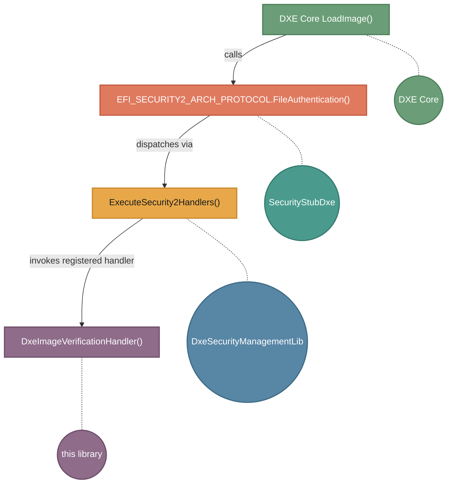
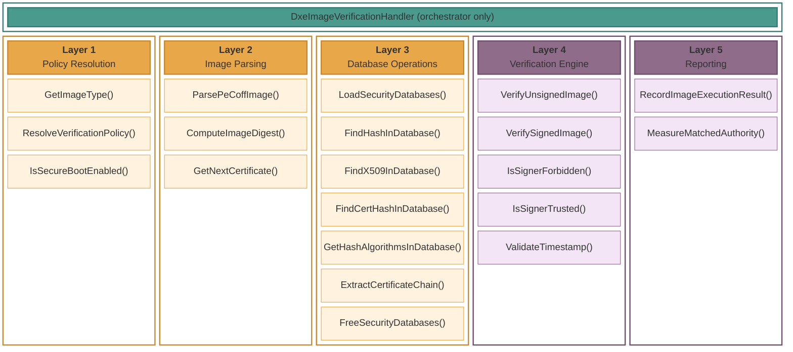
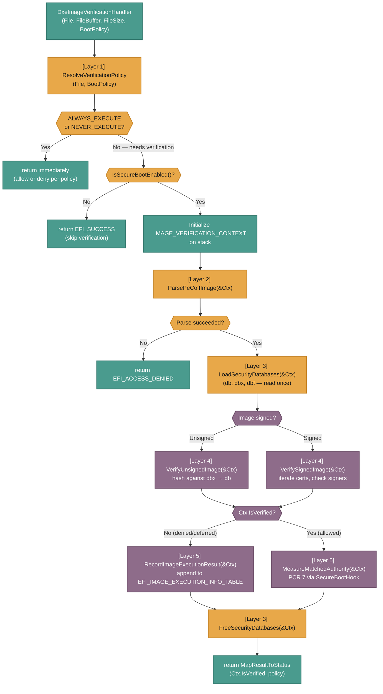
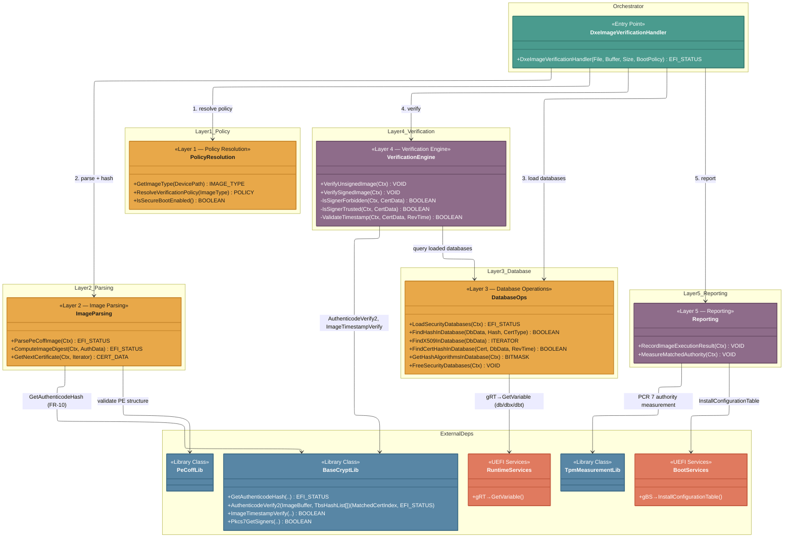

# DxeImageVerificationLib Rearchitecture

> **Companion document**: `DxeImageVerificationLib_CurrentArchitecture.md` contains the
> full function inventory, data-flow diagrams, and `SignatureType` consumption table for
> the current implementation. This document focuses on *why* and *how* to rearchitect;
> it references the baseline doc rather than duplicating it.

---

## 1. Description

`DxeImageVerificationLib` is the UEFI Secure Boot image verification policy engine in
`SecurityPkg`. It is a library instance of the `NULL` library class that self-registers
as a Security2 handler during its constructor.

**Dispatch chain:**



REF: [SecurityStubDxe::ExecuteSecurity2Handlers](https://github.com/tianocore/edk2/blob/0dddd6549d8d13d9bc5440d696fc702c3319172f/MdeModulePkg/Universal/SecurityStubDxe/SecurityStub.c#L147)

REF: [DxeImageVerificationLib::DxeImageVerificationHandler](https://github.com/tianocore/edk2/blob/0dddd6549d8d13d9bc5440d696fc702c3319172f/SecurityPkg/Library/DxeImageVerificationLib/DxeImageVerificationLib.c#L1659)

The handler receives the image buffer, device path, and boot policy flag. It decides
whether to allow (`EFI_SUCCESS`), defer (`EFI_SECURITY_VIOLATION`), or deny
(`EFI_ACCESS_DENIED`) execution based on:

- The image source type (firmware volume, option ROM, removable media, fixed media)
- Platform policy PCDs (`PcdOptionRomImageVerificationPolicy`, etc.)
- The Secure Boot enable state (`SecureBoot` variable — **SetupMode or UserMode
  only**; AuditMode and DeployedMode are removed per the revised UEFI Specification)
- Signature verification against the `db` (allow), `dbx` (deny), and `dbt` (timestamp
  authority) security databases

The handler also logs verification outcomes to the `EFI_IMAGE_EXECUTION_INFO_TABLE`
system configuration table and triggers authority measurement via `SecureBootHook()`.

### 1.1 Relationship with Measured Boot

Two distinct measurement paths interact with image verification:

1. Image measurement -- Separate Security2 handlers (`DxeTpmMeasureBootLib`,
   `DxeTpm2MeasureBootLib`) measure the *image itself* into TPM PCRs. These handlers
   are registered alongside `DxeImageVerificationHandler` and dispatched independently
   by `ExecuteSecurity2Handlers()`. They have no code dependency on this library.

2. Authority measurement -- `SecureBootHook()` in `Measurement.c` (part of *this*
   library) measures the *db/dbx entry that matched* during signature lookup. It is
   called from two locations:
   - `IsSignatureFoundInDatabase()` — when a hash match is found in `db`
   - `IsAllowedByDb()` — when an X.509 certificate-based trust match succeeds

   This records *which trust anchor authorized* the image, not the image content.

   The authority measurement path uses `TpmMeasurementLib` to extend PCR 7 and
   maintains a de-duplication cache so each unique authority entry is measured at most
   once per boot.

**Rearchitecture impact**: The coupling between `IsSignatureFoundInDatabase()` and
`SecureBootHook()` means database lookup has a measurement side-effect. The new
architecture must either preserve this call site or move authority measurement to an
explicit reporting phase (see Section 6.5).

---

## 2. Responsibilities

The current implementation mixes the following discrete responsibilities in a single
~2,500 line control path:

| # | Responsibility | Current location |
|---|---------------|-----------------|
| R1 | **Image source classification** — Determine origin (FV, option ROM, removable, fixed media) from device path and protocol probing | `GetImageType()` |
| R2 | **Policy resolution** — Map image type to verification policy via PCDs | `DxeImageVerificationHandler` (inline) |
| R3 | **Secure Boot mode check** — Read `SecureBoot` variable, short-circuit if disabled. Current code also checks variable attributes to detect AuditMode (to be removed — see FR-8) | `DxeImageVerificationHandler` (inline) |
| R4 | **PE/COFF parsing** — Validate image structure, extract NT headers, locate certificate data directory | `DxeImageVerificationHandler` (inline) + `DxeImageVerificationLibImageRead()` |
| R5 | **Authenticode digest computation** — Hash image excluding checksum and security directory per PE/COFF Appendix A. **Duplicated** in measured boot libraries (`DxeTpmMeasureBootLib`/`DxeTpm2MeasureBootLib`). To be moved to `BaseCryptLib` — see FR-10 | `HashPeImage()` |
| R6 | **Hash algorithm detection** — Parse PKCS#7 ASN.1 to determine digest algorithm OID. To be replaced by `BaseCryptLib` `GetAuthenticodeHash()` — see FR-10 | `HashPeImageByType()` |
| R7 | **DBX revocation check (hash)** — Look up image hash in `dbx` | `IsSignatureFoundInDatabase()` called with `dbx` |
| R8 | **DBX revocation check (X.509 signer)** — Verify image Authenticode signature against X.509 certs in `dbx` | `IsForbiddenByDbx()` |
| R9 | **DB trust verification (X.509)** — Verify image Authenticode signature against X.509 trust anchors in `db` | `IsAllowedByDb()` |
| R9a | **DB trust verification (TBS cert-hash)** — Walk image certificate chain, match TBS hash against `gEfiCertX509Sha*` entries in `db` to establish trust anchor (new — see FR-9) | *Not yet implemented* |
| R10 | **DB trust verification (hash)** — Look up image hash in `db` | `IsSignatureFoundInDatabase()` called with `db` |
| R11 | **TBS cert-hash revocation + timestamp exception** — Check certificate chain hashes against `dbx` X509Sha* entries, validate signing time against `dbt` timestamp authorities. Note: TBS cert-hash is also used in `db` for trust anchor matching (FR-9) | `IsCertHashFoundInDbx()` + `PassTimestampCheck()` |
| R12 | **Execution info table logging** — Record verification outcome in `EFI_IMAGE_EXECUTION_INFO_TABLE` | `AddImageExeInfo()` + `GetImageExeInfoTableSize()` |
| R13 | **Authority measurement** — Measure matching db/dbx entry into TPM PCR 7 | `SecureBootHook()` (Measurement.c) |
| R14 | **ReadyToBoot table publication** — Ensure execution info table exists at ReadyToBoot | `OnReadyToBoot()` |

---

## 3. Requirements

Any rearchitecture of `DxeImageVerificationLib` **MUST** satisfy the following:

### 3.1 Functional Requirements

- **FR-1**: Produce identical allow/deny/defer decisions for all image types and
  Secure Boot states as the current implementation, with the exceptions of:
  AuditMode/DeployedMode removal (FR-8), multi-certificate revocation semantics
  (FR-4), and TBS cert-hash trust anchor support in db (FR-9). The UEFI
  Specification (Section 32.4.2 "Image Validation" and Section 32.5 "User
  Identification") defines the normative behavior.

- **FR-2**: Preserve and extend `SignatureType` consumption patterns documented in
  the baseline architecture doc Section 2.1. The updated patterns are:
  - `db`: image hash lookup (`gEfiCertSha*Guid`), X.509 trust anchor
    (`gEfiCertX509Guid`), **TBS cert-hash trust anchor
    (`gEfiCertX509Sha256Guid`/`384`/`512`)** — new, see FR-9
  - `dbx`: image hash deny-list (`gEfiCertSha*Guid`), X.509 forbidden signer
    (`gEfiCertX509Guid`), TBS cert-hash revocation
    (`gEfiCertX509Sha256Guid`/`384`/`512`)
  - `dbt`: X.509 timestamp authority (`gEfiCertX509Guid`)

- **FR-3**: DBX **must** override DB — a hash or signer found in both databases must
  be denied. This is the security-critical ordering invariant.

- **FR-4**: Change multi-certificate signed image revocation semantics. The
  current implementation denies an image if **any** certificate in the PE/COFF
  certificate data directory has a revoked signer. The rearchitected library must
  change this to: an image is denied only if **all** certificates in the data
  directory are revoked. If at least one certificate has a valid, non-revoked
  signer that is trusted by `db`, the image is allowed. This aligns with the
  intent that multi-signing provides redundancy — a single revoked signer should
  not invalidate an image that has an alternative valid signer.
  - Iteration order: process each `WIN_CERTIFICATE` entry in the certificate
    data directory sequentially.
  - For each certificate: run the full signer verification (dbx check, db trust
    check, timestamp exception) as defined by `VerifySignedImage()`.
  - **Short-circuit on trust**: If any certificate's signer is trusted (not
    revoked, found in db), the image is **allowed** immediately — remaining
    certificates need not be checked.
  - **Deny only if exhausted**: If all certificates are checked and none
    produced a trusted signer, the image is denied.
  - The image hash check against dbx (FR-3) still takes precedence: if the
    image hash itself is in dbx, the image is denied regardless of signers.

- **FR-5**: Support PE32 and PE32+ image formats including correct Authenticode digest
  computation per the Microsoft PE/COFF specification Appendix A.

- **FR-6**: Publish `EFI_IMAGE_EXECUTION_INFO_TABLE` entries for failed/deferred
  images with correct `EFI_IMAGE_EXECUTION_ACTION` values.

- **FR-7**: Publish an empty `EFI_IMAGE_EXECUTION_INFO_TABLE` at ReadyToBoot if no
  entries were recorded.

- **FR-8**: **Drop AuditMode and DeployedMode support.** The revised UEFI
  Specification defines only two Secure Boot modes: **SetupMode** and **UserMode**.
  The rearchitected library must:
  - Treat the `SecureBoot` variable as a simple enabled/disabled flag — no attribute
    inspection to detect AuditMode (the current code checks that the variable
    attributes equal `EFI_VARIABLE_BOOTSERVICE_ACCESS | EFI_VARIABLE_RUNTIME_ACCESS`
    only — i.e., the *absence* of `EFI_VARIABLE_TIME_BASED_AUTHENTICATED_WRITE_ACCESS`
    — to distinguish a genuine disabled state from AuditMode).
  - Remove any code path that continues verification when `SecureBoot` is disabled
    (the current "but not AuditMode" exception).
  - Not reference `AuditMode`, `DeployedMode`, or their associated variable
    attributes anywhere in the implementation.
  - Simplify `IsSecureBootEnabled()` (Layer 1) to: if `SecureBoot` variable is
    absent or `SECURE_BOOT_MODE_DISABLE` → skip verification, period.

- **FR-9**: **Support TBS certificate hash matching in `db` (allow-list).** The
  current implementation only consumes `gEfiCertX509Sha256Guid`/`384`/`512`
  entries from `dbx` (revocation). The rearchitected library must also support
  these `SignatureType` values in `db` as trust anchors. The behavior is:
  - When evaluating a signed image against `db`, extract the **full certificate
    chain** from the image's Authenticode/PKCS#7 signature.
  - For each `gEfiCertX509Sha*` entry in `db`, compute the TBS (To-Be-Signed)
    hash of each certificate in the chain.
  - If any certificate's TBS hash matches a `db` entry, that certificate becomes
    the **trust anchor** for the image — the image is allowed.
  - This enables enrolling a trust anchor by cert hash rather than the full X.509
    blob, reducing `db` variable size and avoiding exposure of the full certificate.
  - The chain walk order should be: leaf (signer) certificate first, then
    intermediate CAs, then root CA. The first match wins.
  - **DBX override (FR-3) applies per-certificate across the entire chain.** Before
    accepting a TBS cert-hash match in `db`, the implementation must check whether
    *any* certificate in the chain matches a `dbx` cert-hash revocation entry. If
    any certificate's TBS hash matches a `dbx` entry, the image is **denied** unless
    the timestamp exception (`dbt`) applies to that specific certificate. This
    ensures FR-3 ("dbx overrides db") holds at the image level across all chain
    certificates, not just the matched trust anchor.
  - If the matching certificate is also found in `dbx` (via cert-hash revocation
    with timestamp), the existing timestamp exception logic (FR-2, `dbt`) applies.

- **FR-10**: **Move Authenticode hash computation to `BaseCryptLib`.** The PE/COFF
  Authenticode digest algorithm (Microsoft PE/COFF Specification, Appendix A) is
  currently implemented in both `DxeImageVerificationLib` (`HashPeImage()` +
  `HashPeImageByType()`) and the measured boot libraries
  (`DxeTpmMeasureBootLib`/`DxeTpm2MeasureBootLib`). This is duplicated,
  error-prone code. The rearchitecture must:
  - Add a new `BaseCryptLib` API — `GetAuthenticodeHash()` — that accepts a PE/COFF
    image buffer and either:
    - (a) a PKCS#7 `AuthData` blob from which it detects the digest algorithm
      internally (replacing the brittle ASN.1 offset parsing in
      `HashPeImageByType()`), or
    - (b) an explicit algorithm selector (for unsigned images where there is no
      PKCS#7 to inspect).
  - The API computes the Authenticode image digest per Appendix A (excluding
    checksum field, excluding security data directory, hashing sections in order)
    and returns the digest bytes, digest size, and algorithm identifier.
  - Remove `HashPeImage()` and `HashPeImageByType()` from this library entirely.
    Layer 2 calls `GetAuthenticodeHash()` instead.
  - The same `GetAuthenticodeHash()` API becomes available to measured boot
    libraries, eliminating their duplicate PE/COFF hash implementations.

  Conceptual API:

  ```c
  EFI_STATUS
  EFIAPI
  GetAuthenticodeHash (
    IN  CONST UINT8  *ImageBuffer,
    IN  UINTN        ImageSize,
    IN  CONST UINT8  *AuthData       OPTIONAL,  // PKCS#7 blob for algorithm auto-detection
    IN  UINTN        AuthDataSize    OPTIONAL,  // 0 if no AuthData
    IN  UINT16       HashAlgId       OPTIONAL,  // Explicit algorithm (used when AuthData is NULL)
    OUT UINT8        *DigestBuffer,             // Caller-provided, MAX_DIGEST_SIZE
    OUT UINTN        *DigestSize,
    OUT EFI_GUID     *CertType                  // e.g., gEfiCertSha256Guid
    );
  ```

- **FR-11**: **Demand-driven hash computation for unsigned images.** The current
  implementation computes Authenticode digests for all supported hash algorithms
  (SHA512, SHA384, SHA256, SHA1) when verifying an unsigned image, regardless of
  which `SignatureType` GUIDs are present in `db`/`dbx` (see Section 4.9). The
  rearchitected library must:
  - After loading security databases (Layer 3), scan `db` and `dbx` to determine
    which hash `SignatureType` GUIDs (`gEfiCertSha256Guid`, `gEfiCertSha384Guid`,
    `gEfiCertSha512Guid`) are actually present.
  - For unsigned images, compute Authenticode digests **only** for algorithms that
    have at least one entry in `db` or `dbx`.
  - For signed images, this optimization does not apply — the digest algorithm is
    determined by the PKCS#7 `AuthData` (FR-10).
  - This is a performance optimization only — it must not change any allow/deny
    decision. An algorithm with no entries in either database cannot produce a
    match, so skipping its digest is semantically equivalent.

### 3.2 Integration Requirements

- **IR-1**: Continue to register via `RegisterSecurity2Handler()` with
  `EFI_AUTH_OPERATION_VERIFY_IMAGE | EFI_AUTH_OPERATION_IMAGE_REQUIRED`.

- **IR-2**: Authority measurement (`SecureBootHook` → `TpmMeasurementLib`) must
  continue to record the specific db/dbx entry that authorized or denied an image.
  The measurement may be relocated within the new architecture but must not be
  dropped.

- **IR-3**: Policy PCDs (`PcdOptionRomImageVerificationPolicy`,
  `PcdRemovableMediaImageVerificationPolicy`, `PcdFixedMediaImageVerificationPolicy`)
  must retain their current semantics and default values.

- **IR-4**: The `.inf` `MODULE_TYPE` must remain `DXE_DRIVER`. The `LIBRARY_CLASS`
  consumer list (`NULL|DXE_DRIVER DXE_RUNTIME_DRIVER DXE_SMM_DRIVER UEFI_APPLICATION
  UEFI_DRIVER`) must be preserved to avoid breaking downstream platform consumers.
  External interface (`RegisterSecurity2Handler` callback signature) must not change.

### 3.3 Quality Requirements

- **QR-1**: Individual verification decisions (hash lookup, cert verification,
  timestamp check) must be unit-testable in a host-based environment without UEFI
  runtime services.

- **QR-2**: No module-scope mutable state shared between verification calls. All
  per-image state must be scoped to a verification context structure.
  **Exception**: The authority measurement de-duplication cache in `Measurement.c`
  (`mMeasuredAuthorityCount`, `mMeasuredAuthorityCountMax`, `mMeasuredAuthorityList`)
  is exempt from this requirement. This cache must persist across verification calls
  by design — measuring the same authority entry twice would violate TCG measurement
  semantics. The cache is managed by the reporting layer (Layer 5) and does not
  participate in verification decisions.

- **QR-3**: Each security database (db, dbx, dbt) should be read at most once per
  verification call. Database reads must be centralized, not scattered across
  helper functions.

---

## 4. Problems with Current Architecture

### 4.1 Global Mutable State

The current implementation uses 8 module-scope mutable variables to carry per-image
state between functions:

```c
EFI_IMAGE_OPTIONAL_HEADER_PTR_UNION  mNtHeader;
UINT32                               mPeCoffHeaderOffset;
EFI_GUID                             mCertType;
UINTN                                mImageSize;
UINT8                                *mImageBase;
UINT8                                mImageDigest[MAX_DIGEST_SIZE];
UINTN                                mImageDigestSize;
EFI_STRING                           mHashTypeStr;
```

Additionally, `Measurement.c` maintains 3 cross-call mutable globals for the authority
measurement de-duplication cache (`mMeasuredAuthorityCount`,
`mMeasuredAuthorityCountMax`, `mMeasuredAuthorityList`). These persist across
verification calls by design — see QR-2 for the exemption rationale.

These globals are written by `HashPeImage()` and read by `IsForbiddenByDbx()`,
`IsAllowedByDb()`, and `IsSignatureFoundInDatabase()`. This creates:

- **Implicit coupling**: Functions depend on call ordering to find valid state.
  `IsForbiddenByDbx()` silently produces wrong results if `HashPeImage()` was not
  called first, with no compile-time or runtime enforcement.
- **No reentrancy**: If a nested image load triggered verification during an existing
  verification call, globals would be corrupted.
- **No testability**: Test harnesses cannot inject specific digest/cert combinations
  without reproducing the exact global mutation sequence.

### 4.2 Monolithic Handler

`DxeImageVerificationHandler()` is approximately 500 lines and contains:

- Policy lookup (PCD reads)
- Secure Boot variable reads
- PE/COFF header parsing and validation
- Certificate table iteration
- Calls to hash, forbid, allow, and lookup functions
- Execution info table construction
- Error path cleanup and result mapping

The function has multiple `goto` targets and deeply nested conditionals that make the
verification decision tree difficult to follow, review, or modify.

### 4.3 Duplicated Database Logic

The timestamp revocation path (`IsCertHashFoundInDbx()` + `PassTimestampCheck()`) is
invoked from *both*:

- `IsForbiddenByDbx()` — to check if a forbidden signer has a timestamp exception
- `IsAllowedByDb()` — to check if an allowed signer's cert has been revoked with a
  timestamp grace period

Each path independently reads `dbx` and `dbt` via `gRT->GetVariable()`, duplicating
allocation and parsing work. This also means `dbx` may be read up to **three times**
in a single verification call (once in `IsForbiddenByDbx`, once in `IsAllowedByDb`,
once in `IsSignatureFoundInDatabase`).

### 4.4 Mixed Concerns

The handler mixes five conceptually distinct concerns in one control path:

1. **Policy** — Should this image type be verified at all?
2. **Parsing** — Is this a valid PE/COFF image? What are its signatures?
3. **Database access** — What do db/dbx/dbt contain right now?
4. **Verification logic** — Given the image digest and databases, is it allowed?
5. **Reporting** — Log the outcome, measure the authority.

These concerns cannot be independently tested, replaced, or extended.

### 4.5 Untestable

There are **no unit tests** for this library. The current architecture makes host-based
testing impractical because:

- Hash computation requires global state setup (`mImageBase`, `mNtHeader`, etc.)
- Database checks call `gRT->GetVariable()` directly — no indirection layer to mock
- Signature verification calls `AuthenticodeVerify()` from `BaseCryptLib` with no
  abstraction boundary
- `AddImageExeInfo()` calls `gBS->InstallConfigurationTable()` — requires boot
  services

### 4.6 Fragile Algorithm Dispatch

`HashPeImageByType()` determines the digest algorithm by parsing raw ASN.1 at a fixed
offset (+32 bytes into the PKCS#7 `ContentInfo` structure). This is:

- **Brittle**: Assumes a specific PKCS#7 encoding layout that may not hold for all
  valid encodings
- **Not extensible**: Adding a new hash algorithm requires understanding the ASN.1
  byte pattern and adding a new OID match
- **Duplicative**: `BaseCryptLib` already has ASN.1 parsing capability that could be
  leveraged instead

### 4.7 Duplicated Authenticode Hash Logic

The PE/COFF Authenticode digest computation (hash image contents excluding checksum
field and security data directory, per Microsoft PE/COFF Appendix A) is implemented
in **two separate libraries**:

1. `DxeImageVerificationLib` — `HashPeImage()` for signature verification
2. `DxeTpmMeasureBootLib` / `DxeTpm2MeasureBootLib` — for TPM image measurement

Both implementations must handle PE32 vs PE32+ format differences, section ordering,
and the exact exclusion regions. Any bug fix or algorithm addition must be applied to
both codebases. This should be a single shared primitive in `BaseCryptLib` (see
FR-10).

### 4.8 Scattered Database Reads

Security database variables are read independently by multiple functions:

| Function | Variables read |
|----------|---------------|
| `DxeImageVerificationHandler` | `SecureBoot` |
| `IsSignatureFoundInDatabase` | `db` or `dbx` (parameterized) |
| `IsForbiddenByDbx` | `dbx` |
| `IsAllowedByDb` | `db`, `dbx` |
| `PassTimestampCheck` | `dbt` |

A single verification call may invoke `gRT->GetVariable()` 5–7 times, repeatedly
allocating and freeing buffers for the same variable content.

### 4.9 Redundant Hash Computation for Unsigned Images

When verifying an unsigned image, the current code iterates **all supported hash
algorithms** (SHA512, SHA384, SHA256, SHA1) and computes a full PE/COFF Authenticode
digest for each — regardless of whether `db` or `dbx` actually contain entries of
that `SignatureType`. For example, if `db` contains only `gEfiCertSha256Guid` entries
and `dbx` contains only `gEfiCertSha256Guid` entries, the code still computes SHA512,
SHA384, and SHA1 digests that can never match anything. Each unnecessary hash requires
a full pass over the image contents.

With the new architecture's "read once, query many" principle (databases loaded before
verification), the loaded `db`/`dbx` buffers can be scanned to discover which hash
`SignatureType` GUIDs are actually present, and only those algorithms need to be
computed.

---

## 5. Proposed Architecture

### 5.1 Design Principles

1. **Explicit state** — All per-verification state lives in a context structure passed
   by pointer. No module-scope mutable variables.
2. **Read once, query many** — Security databases are loaded once at the start of
   verification and exposed through a query interface.
3. **Layered separation** — Each concern (policy, parsing, database, verification,
   reporting) is a distinct group of functions with defined inputs and outputs.
4. **Testable boundaries** — Database reads and crypto operations are accessed through
   function pointers or thin wrappers that can be substituted in test harnesses.

### 5.2 Verification Context

Replace all module-scope globals with a per-call context structure:

```c
typedef struct {
  //
  // Image identity
  //
  UINT8                                *ImageBase;
  UINTN                                ImageSize;
  EFI_DEVICE_PATH_PROTOCOL             *DevicePath;

  //
  // PE/COFF parsed state
  //
  UINT32                               PeCoffHeaderOffset;
  EFI_IMAGE_OPTIONAL_HEADER_PTR_UNION  NtHeader;
  BOOLEAN                              IsPe32Plus;

  //
  // Computed digest (set by image hashing layer)
  //
  UINT8                                ImageDigest[MAX_DIGEST_SIZE];
  UINTN                                ImageDigestSize;
  EFI_GUID                             CertType;

  //
  // Loaded security databases (set by database layer)
  //
  UINT8                                *DbData;
  UINTN                                DbSize;
  UINT8                                *DbxData;
  UINTN                                DbxSize;
  UINT8                                *DbtData;
  UINTN                                DbtSize;

  //
  // Verification result (set by verification engine)
  //
  BOOLEAN                              IsVerified;
  EFI_IMAGE_EXECUTION_ACTION           Action;
  EFI_SIGNATURE_LIST                   *MatchedSignature;
  // NOTE: MatchedSignature is a borrowed pointer into DbData or DbxData.
  // It is valid only until FreeSecurityDatabases() is called. The handler
  // flow guarantees that all consumers (MeasureMatchedAuthority,
  // RecordImageExecutionResult) execute before FreeSecurityDatabases().
} IMAGE_VERIFICATION_CONTEXT;
```

This structure is stack-allocated by the handler entry point and passed by pointer to
all subordinate functions. It is freed (database buffers) before the handler returns.

### 5.3 Layered Responsibilities



#### Layer 1: Policy Resolution

- **Input**: Device path, boot policy flag
- **Output**: `IMAGE_VERIFICATION_POLICY` (always execute, never execute, verify +
  action-on-failure)
- **Functions**:
  - `GetImageType()` — Classify image source (unchanged logic)
  - `ResolveVerificationPolicy()` — Map image type to policy via PCDs
  - `IsSecureBootEnabled()` — Read `SecureBoot` variable; return TRUE only if
    present and value is `SECURE_BOOT_MODE_ENABLE`. No AuditMode/DeployedMode
    attribute inspection (FR-8).

#### Layer 2: Image Parsing

- **Input**: Image buffer, image size, context pointer
- **Output**: Populated PE/COFF fields in context, certificate iterator
- **Functions**:
  - `ParsePeCoffImage()` — Validate PE/COFF structure, populate context header fields,
    locate certificate data directory
  - `ComputeImageDigest()` — Thin wrapper that calls `BaseCryptLib`
    `GetAuthenticodeHash()` (FR-10). For signed images, passes the PKCS#7 `AuthData`
    for algorithm auto-detection. For unsigned images, called once per algorithm
    that is actually present in `db`/`dbx` (determined by
    `GetHashAlgorithmsInDatabase()` — see FR-11). Stores result in
    `Ctx->ImageDigest`, `Ctx->ImageDigestSize`, `Ctx->CertType`.
  - `GetNextCertificate()` — Iterator over certificate data directory entries

#### Layer 3: Database Operations

- **Input**: Context pointer (for buffer storage)
- **Output**: Populated db/dbx/dbt buffers in context
- **Functions**:
  - `LoadSecurityDatabases()` — Read db, dbx, dbt once into context buffers
  - `FindHashInDatabase()` — Search a loaded database for a hash match
  - `FindX509InDatabase()` — Iterate X.509 certs in a loaded database
  - `FindCertHashInDatabase()` — Search for TBS cert-hash entries
    (`gEfiCertX509Sha256Guid`/`384`/`512`) in a loaded database. Generalized
    from the current `IsCertHashFoundInDbx()` to work against **any** database
    (db or dbx). When searching `dbx`, returns the revocation time. When
    searching `db`, returns a match indicating trust anchor (FR-9).
  - `GetHashAlgorithmsInDatabase()` — Scan loaded `db` and `dbx` buffers and
    return a bitmask (or list) of hash `SignatureType` GUIDs that are present
    (e.g., `gEfiCertSha256Guid`, `gEfiCertSha384Guid`, `gEfiCertSha512Guid`).
    Used by `VerifyUnsignedImage()` to determine which digests to compute
    (FR-11).
  - `FreeSecurityDatabases()` — Release context database buffers

#### Layer 4: Verification Engine

- **Input**: Context with populated digest and database buffers, certificate data
- **Output**: `IsVerified`, `Action`, `MatchedSignature` in context
- **Functions**:
  - `VerifyUnsignedImage()` — Check unsigned image hash against dbx then db.
    Calls `GetHashAlgorithmsInDatabase()` to determine which hash algorithms
    have entries in `db`/`dbx`, then iterates only those algorithms: for each,
    calls `ComputeImageDigest()` and checks against dbx then db (FR-11).
    A dbx hash match **MUST** short-circuit immediately without checking db
    (FR-3 security invariant: dbx overrides db).
  - `VerifySignedImage()` — Iterate certificates in the PE/COFF certificate
    data directory. For each certificate, check the signer against dbx then db.
    **Short-circuit on trust**: if any certificate's signer is trusted and not
    revoked, the image is allowed immediately (FR-4). Deny only if all
    certificates are exhausted with no trusted signer found.
  - `IsSignerForbidden()` — Check signer cert against dbx X.509 entries
    (replaces `IsForbiddenByDbx`, operates on loaded data)
  - `IsSignerTrusted()` — Check signer against db trust anchors via
    `AuthenticodeVerify2()`. This function handles both X.509 and TBS cert-hash
    matching internally:
    1. **X.509 match**: Verify signature against raw X.509 certs in db
    2. **TBS cert-hash match** (FR-9): Extract certificate chain from PKCS#7,
       compute TBS hash of each cert, match against `gEfiCertX509Sha*` entries
       in db. First chain cert whose TBS hash matches establishes trust.
    Returns the matched certificate (if any). If the matched certificate is also
    found in dbx via cert-hash revocation, apply timestamp exception logic via
    `ValidateTimestamp()`.
  - `ValidateTimestamp()` — Timestamp verification against dbt
    (replaces `PassTimestampCheck`, operates on loaded data)

#### Layer 5: Reporting

- **Input**: Context with verification result
- **Output**: Side effects (execution info table update, authority measurement)
- **Functions**:
  - `RecordImageExecutionResult()` — Build and append `EFI_IMAGE_EXECUTION_INFO`
    entry (replaces `AddImageExeInfo`)
  - `MeasureMatchedAuthority()` — Call `SecureBootHook()` with the matched db/dbx
    entry. Moved here from `IsSignatureFoundInDatabase()` so measurement is a
    post-verification step rather than a side-effect of lookup.

### 5.4 Proposed Handler Flow



### 5.5 Proposed Interaction Diagram



---

## 6. Testing Strategy

### 6.1 Testability by Layer

| Layer | Host-testable? | Mocking required | Test focus |
|-------|---------------|-----------------|-----------|
| L1 Policy | Yes | PCD values, `SecureBoot` variable | Correct policy mapping for all image types and PCD combinations; SetupMode/UserMode only (no AuditMode/DeployedMode) |
| L2 Parsing | Yes | None (pure computation) | PE32/PE32+ digest correctness against known-good Authenticode hashes |
| L3 Database | Partially | `gRT->GetVariable` | Correct parsing of `EFI_SIGNATURE_LIST` structures, hash/cert matching |
| L4 Verification | Yes | Database query functions, `BaseCryptLib` | Decision matrix: unsigned/signed × db/dbx/dbt combinations × timestamp scenarios × TBS cert-hash in db (FR-9) |
| L5 Reporting | Partially | `gBS->InstallConfigurationTable`, `TpmMeasurementLib` | Correct `EFI_IMAGE_EXECUTION_INFO` construction |

### 6.2 Test Approach

- **Unit tests** using `UnitTestFrameworkPkg` `HOST_APPLICATION` test modules.
- **Database query layer**: Provide pre-built `EFI_SIGNATURE_LIST` byte arrays as test
  fixtures. Functions operate on loaded buffers, so `gRT` is not needed at test time.
- **Verification engine**: Inject `AuthenticodeVerify2()` return values and mock
  database query results to exercise all decision branches without real crypto.
  Must include:
  - TBS cert-hash trust anchor matching in db (FR-9) — verify that
    `AuthenticodeVerify2()` correctly matches TBS hashes against db entries and
    returns the matched certificate index; verify interaction with dbx cert-hash
    revocation + timestamp exception.
  - Multi-certificate signed images (FR-4) — test that a single trusted signer
    allows the image even when other signers are revoked; test that the image is
    denied only when all signers are revoked; test that image hash in dbx still
    overrides regardless of signers.
- **Integration tests**: Full handler flow with mock `gRT`/`gBS` to validate
  end-to-end behavior matches baseline flowchart (Section 4 of baseline doc),
  extended with FR-9 scenarios.

### 6.3 Regression Oracle

The baseline architecture doc's verification flow diagram (Section 4) serves as the
regression specification. Each decision branch in that flowchart should map to at least
one test case covering the allow and deny paths.

---

## 7. Migration Strategy

### Phase 1: Introduce Context Structure

- Define `IMAGE_VERIFICATION_CONTEXT` structure
- Modify `DxeImageVerificationHandler` to allocate context on stack and populate
  `ImageBase`, `ImageSize`, `DevicePath`
- Thread context pointer through hash and verification functions — write digest into
  context instead of globals
- Remove corresponding globals (`mImageBase`, `mImageSize`, `mImageDigest`, etc.)
- **Checkpoint**: Functional equivalence — behavior is identical, state is now explicit

### Phase 1a: Implement `GetAuthenticodeHash()` in `BaseCryptLib`

- Implement `GetAuthenticodeHash()` API in `BaseCryptLib` (FR-10)
- Migrate PE/COFF Authenticode digest logic from `HashPeImage()` +
  `HashPeImageByType()` into the new API
- Replace `HashPeImage()` / `HashPeImageByType()` calls with `ComputeImageDigest()`
  → `GetAuthenticodeHash()`
- Delete `HashPeImage()` and `HashPeImageByType()` from this library
- Optionally: migrate `DxeTpmMeasureBootLib` / `DxeTpm2MeasureBootLib` to use the
  same API (can be done independently)
- **Checkpoint**: Authenticode hash is computed by `BaseCryptLib`; no PE/COFF hash
  logic remains in this library or is duplicated across libraries

### Phase 2: Centralize Database Reads

- Implement `LoadSecurityDatabases()` / `FreeSecurityDatabases()`
- Modify `IsForbiddenByDbx()`, `IsAllowedByDb()`, `IsSignatureFoundInDatabase()` to
  accept pre-loaded database buffers from context instead of calling
  `gRT->GetVariable()` internally
- Remove per-function `GetVariable` calls for db/dbx/dbt
- **Checkpoint**: Each database read once per verification call

### Phase 3: Extract Verification Engine and Enhance BaseCryptLib

- Implement `AuthenticodeVerify2(ImageBuffer, TbsHashList[])` in BaseCryptLib.
  This new API internalizes the certificate chain extraction and TBS hash
  computation for FR-9 TBS cert-hash matching. It returns the index of the
  matched certificate (or -1 if no match). This consolidates X.509 and
  TBS cert-hash verification into a single BaseCryptLib call.
- Refactor `IsForbiddenByDbx()` → `IsSignerForbidden()` operating on context
- Refactor `IsAllowedByDb()` → `IsSignerTrusted()` operating on context,
  calling `AuthenticodeVerify2()` to check both X.509 and TBS cert-hash
  trust anchors
- Consolidate `IsCertHashFoundInDbx()` + `PassTimestampCheck()` into unified
  `ValidateTimestamp()` called from one location
- Implement `VerifyUnsignedImage()` and `VerifySignedImage()` as top-level
  verification entry points
- Implement FR-4 multi-certificate semantics in `VerifySignedImage()`: iterate
  certificates, short-circuit on first trusted signer, deny only when all signers
  are revoked
- **Checkpoint**: Verification engine is a pure function of context — testable.
  BaseCryptLib owns certificate chain extraction and TBS computation for FR-9.
  **Note**: Multi-certificate images with mixed revoked/trusted signers will now
  produce different results than the current implementation (FR-4 behavior change).

### Phase 4: Extract Reporting

- Move `SecureBootHook()` call from `IsSignatureFoundInDatabase()` to
  `MeasureMatchedAuthority()` called after verification completes
- Refactor `AddImageExeInfo()` → `RecordImageExecutionResult()` operating on context
- **Checkpoint**: Reporting is post-verification, no side effects during lookup

### Phase 5: Add Tests

- Write unit tests for Layer 4 (verification engine) first — highest value
- Add Layer 2 (image parsing / digest) tests with known-good PE images
- Add Layer 3 (database query) tests with constructed `EFI_SIGNATURE_LIST` fixtures
- Add integration test exercising full handler flow
- **Checkpoint**: Test coverage for all decision branches in baseline flowchart

### Migration Invariant

At the end of **every phase**, the library must produce identical results for all
inputs, **except** for the intentional behavior changes documented in FR-1:

- FR-4: Multi-certificate images with mixed revoked/trusted signers are now
  allowed (previously denied). Introduced in Phase 3.
- FR-8: AuditMode/DeployedMode code paths removed. Introduced in Phase 1.
- FR-9: TBS cert-hash entries in `db` now establish trust anchors. Introduced
  in Phase 3.

The baseline architecture doc's flowchart (Section 4) and `SignatureType`
table (Section 2.1) define the expected behavior for unchanged paths.

---

## 8. Open Questions

These items require discussion and decisions before implementation begins:

1. **SecureBootHook relocation** — Moving authority measurement from the database
   lookup layer to the reporting layer changes *when* measurement occurs relative to
   the verification decision. Is there a spec or platform requirement that measurement
   must happen during lookup (before the allow/deny decision is finalized)?

2. **Database caching across calls** — Should loaded db/dbx/dbt be cached across
   multiple `DxeImageVerificationHandler` invocations (e.g., for the duration of a
   boot phase), or must they be re-read every call to reflect potential runtime
   updates? Current behavior re-reads every call.

3. **Separate library class for verification engine** — Should Layer 4 be a distinct
   `ImageVerificationEngineLib` library class (separate `.inf`, mockable in platform
   DSC), or should all layers remain internal to a single library instance? A separate
   class improves testability but adds build complexity.

4. **`GetAuthenticodeHash()` API design** — **Resolved: move to `BaseCryptLib`**
   (FR-10). The new API handles both PKCS#7 algorithm auto-detection (replacing
   `HashPeImageByType`) and PE/COFF Appendix A digest computation (replacing
   `HashPeImage`). Open sub-questions:
   - Should the API accept a raw image buffer and parse PE/COFF headers internally,
     or should it accept pre-parsed section table data? Internal parsing is simpler
     for callers but couples `BaseCryptLib` to PE/COFF format knowledge.
   - Should the unsigned-image path (no PKCS#7 blob) try all algorithms and return
     multiple digests, or should the caller iterate and call once per algorithm?
   - Should `DxeTpmMeasureBootLib` migration be done in the same change series or
     as a follow-up?

5. **Certificate chain extraction for FR-9** — `BaseCryptLib` currently has
   `Pkcs7GetSigners()` which returns signer certs. Does it also expose the full
   chain (intermediates + root)? If not, a new `BaseCryptLib` API may be needed
   (e.g., `Pkcs7GetCertificateChain()`) to walk the PKCS#7 certificate set in
   order. Alternatively, could the chain extraction be done using existing
   `X509GetTBSCert()` iteratively on raw ASN.1 parsing of the PKCS#7 certificates
   field?

6. **Multi-file vs. single-file** — Should the layers be implemented in separate `.c`
   files within the library directory (e.g., `PolicyResolution.c`, `ImageParsing.c`,
   `DatabaseOps.c`, `VerificationEngine.c`, `Reporting.c`), or remain in a single
   file with clear section markers?

7. **EFI_IMAGE_EXECUTION_INFO_TABLE lifetime** — The current `AddImageExeInfo()`
   allocates a new runtime pool buffer, copies the existing table, installs the new
   pointer via `InstallConfigurationTable()`, and frees the old buffer. There is no
   memory leak — the previous allocation is properly freed on each reallocation. The
   final table persists as a system configuration table until platform reset, which
   is by-design behavior for configuration tables. No changes needed.

8. **Scope of rearchitecture** — Beyond the AuditMode/DeployedMode removal (FR-8)
   and TBS cert-hash in db (FR-9),
   is this otherwise a refactor-only effort (same `.inf`, same external interface,
   same behavior), or is there appetite to also fix other known bugs and spec
   deviations discovered during the analysis?
