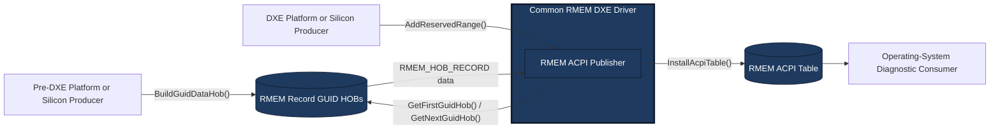

# Reserved-Memory Reporting through ACPI

Copyright (c) Microsoft Corporation.
SPDX-License-Identifier: BSD-2-Clause-Patent

## Status

Reserved-Memory Reporting (RMEM) is a proposed firmware interface for reporting
reserved physical-memory ranges to operating-system diagnostic software. This
implementation supports design discussion and platform evaluation. The `RMEM`
ACPI signature, wire format, category values, GUIDs, and publication policy are
not standardized and may change based on review.

The ACPI table definition requires review by the appropriate standards body and
an official signature allocation before it can be treated as an industry
standard.

## Motivation

Firmware can reserve physical memory for security services, device operation,
firmware runtime use, shared communication, crash handling, and other platform
functions. Operating systems generally report an aggregate hardware-reserved
amount without explaining the purpose of each range.

RMEM is intended to help:

- Explain differences between installed and operating-system-visible memory.
- Diagnose unexpectedly large reservations.
- Compare firmware configurations across systems.
- Attribute reservations without a vendor-specific kernel-mode or user-mode
  driver.

## Goals

- Report the base address, size, purpose category, and diagnostic label for
  each authoritative reserved-memory range.
- Keep platform-specific discovery separate from common table construction.
- Support reservations known before DXE and reservations finalized during DXE.
- Publish one versioned, checksummed ACPI table.
- Avoid changing the system memory map or granting access to reported ranges.

## Non-Goals

- Defining ownership, access permissions, or security policy for a range.
- Replacing the UEFI memory map, ACPI resource descriptions, or existing
  architecture-specific reservation mechanisms.
- Allowing an operating system or application to access reported memory.
- Reporting device MMIO, uninstalled address space, alignment holes, or
  ordinary usable memory.
- Standardizing platform-specific discovery mechanisms.

## Architecture

Range discovery remains with platform and silicon modules. The common RMEM DXE
publisher owns validation, conflict handling, serialization, and ACPI table
installation.



A platform may use the pre-DXE path, the DXE path, or both. Each reservation
should have one owning producer and one transport path.

### Pre-DXE Producers

A producer creates one `RMEM_HOB_RECORD` GUID HOB for each static reservation
that is positively known before DXE. The producer must use an authoritative
reservation source. A gap in the UEFI memory map is not sufficient evidence
that a range is reserved DRAM.

The HOB record is defined in
`MdePkg/Include/Guid/ReservedMemoryReportingHob.h`.

### DXE Producers

A DXE producer locates `EDKII_RMEM_REGISTRATION_PROTOCOL` and calls
`AddReservedRange()` for a reservation allocated, discovered, or finalized
during DXE. The publisher copies the label before returning.

The registration protocol is defined in
`MdePkg/Include/Protocol/ReservedMemoryReporting.h`.

### Common Publisher

`RmemAcpiDxe` performs the following operations:

1. Imports and validates all RMEM GUID HOB instances.
2. Installs the DXE registration protocol.
3. Accepts registrations until `ReadyToBoot`.
4. Applies the same validation and conflict policy to both producer paths.
5. Freezes the entry set at `ReadyToBoot`.
6. Constructs, checksums, and installs one RMEM ACPI table.

## Revision 1 Table Layout

The proposed table contains a standard 36-byte ACPI description header, a
4-byte entry count, and zero or more packed 52-byte entries.

```text
+----------------------+------------+----------+----------+----------+------------+
| ACPI header          | EntryCount | Base     | Size     | Category | Label      |
| 36 bytes             | 4 bytes    | 8 bytes  | 8 bytes  | 4 bytes  | 32 bytes   |
+----------------------+------------+----------+----------+----------+------------+
|<---- table header: 40 bytes ----->|<------- each entry: 52 bytes ------------->|
```

The total table length is `40 + (52 * EntryCount)` bytes.

| Table offset | Size | Field | Description |
| ---: | ---: | --- | --- |
| 0 | 36 | `Header` | Standard ACPI description header |
| 36 | 4 | `EntryCount` | Number of entries following the header |
| 40 | `52 * EntryCount` | `Entries` | Packed array of RMEM entries |

Each entry has the following layout:

| Entry offset | Size | Field | Description |
| ---: | ---: | --- | --- |
| 0 | 8 | `Base` | First physical byte of the reserved range |
| 8 | 8 | `Size` | Range length in bytes |
| 16 | 4 | `Category` | Numeric purpose category |
| 20 | 32 | `Label` | Null-terminated, zero-padded ASCII label |

The authoritative structure definitions are in
`MdePkg/Include/IndustryStandard/ReservedMemoryReportingTable.h`.

## Categories

Revision 1 proposes the following wire values:

| Value | Category | Intended use |
| ---: | --- | --- |
| 0 | Unknown | Invalid sentinel for missing or uninitialized values |
| 1 | Security | Isolated execution, security processors, or protected services |
| 2 | SharedComms | Buffers shared across firmware execution environments |
| 3 | DisplayFramebuffer | Pre-OS or persistent display framebuffer memory |
| 4 | GpuReserved | Memory reserved for graphics use |
| 5 | NpuReserved | Memory reserved for neural-processing use |
| 6 | FirmwareRuntime | Runtime data, services, or crash diagnostics |
| 7 | Other | A reservation that does not fit another category |

`RmemCategoryMax` is an exclusive implementation bound and is not a valid wire
value. Producers must provide a category greater than `RmemCategoryUnknown` and
less than `RmemCategoryMax`.

## Validation and Conflict Policy

The publisher currently:

- Rejects HOBs with an unexpected payload size, revision, or nonzero reserved
  field.
- Rejects zero-sized ranges and physical-address arithmetic overflow.
- Rejects unknown, maximum, and out-of-range categories.
- Rejects labels that are not null-terminated within the fixed label field.
- Returns `EFI_ALREADY_STARTED` for an exact duplicate.
- Rejects any other overlap.
- Rejects registration after finalization.
- Limits the table to 64 entries.
- Suppresses publication after an invalid range, invalid category, oversized
  label, overlap, or capacity failure.

The failure policy, duplicate policy, overlap policy, and entry limit remain
subjects for design review.

## Security and Privacy

The table exposes physical addresses, sizes, categories, and labels to software
that can retrieve firmware tables. Producers must not include secrets, product
codenames, unique device information, or memory contents in a label.

Only authoritative firmware producers should register entries. Consumers must
treat the table as untrusted input and validate its signature, length, revision,
checksum, entry count, strings, and arithmetic before using it.

RMEM is diagnostic metadata. It does not grant access to a reported range and
must not be used as the sole source for access-control or memory-ownership
decisions.

## Platform Integration

To evaluate RMEM on a platform:

1. Add `MdeModulePkg/Universal/Acpi/RmemAcpiDxe/RmemAcpiDxe.inf` to the platform
   DSC and firmware-volume FDF.
2. Ensure `EFI_ACPI_TABLE_PROTOCOL` is available when the driver dispatches.
3. Create RMEM GUID HOBs for authoritative static reservations, register DXE
   reservations through the protocol, or use both paths.
4. Assign each reservation to one producer and avoid conflicting ranges.
5. Retrieve the resulting table through the operating system's supported ACPI
   table interface and validate it before decoding entries.
