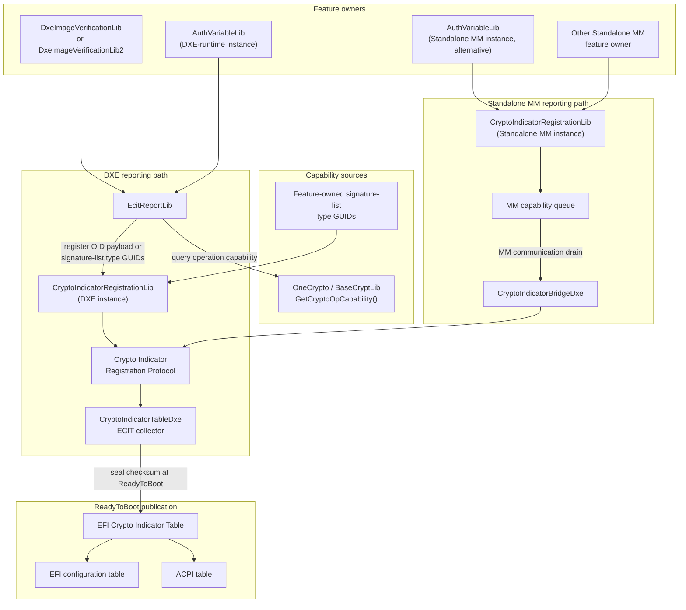

# EFI Crypto Indicator Table Reporting Flow

This diagram summarizes the ECIT reporting infrastructure added by this change.
Feature owners report the algorithms and data types they actually use. The DXE
collector assembles those records and publishes a sealed table at `ReadyToBoot`.

## Reporting model

- `EcitReportLib` queries `GetCryptoOpCapability()` for a feature's
  crypto-operation payload and registers it with the DXE collector.
- A feature can instead register its own payload, such as the
  `EFI_SIGNATURE_LIST` type GUIDs it accepts from Secure Boot databases.
- Standalone MM feature owners queue their records locally. `CryptoIndicatorBridgeDxe`
  drains those records into the DXE collector before the table is sealed.
- The collector owns table construction, duplicate-feature rejection, length
  validation, checksum generation, and publication.

## Standalone MM features

Standalone MM code cannot locate the DXE registration protocol directly. A
feature owner that runs in `MM_STANDALONE` therefore reports through the
`CryptoIndicatorRegistrationLibStandaloneMm` instance instead.

`AuthVariableLib` supports both `DXE_RUNTIME_DRIVER` and `MM_STANDALONE`.
The two `AuthVariableLib` nodes in the diagram represent phase-specific
instances of the same library class. They are alternatives for a given
platform feature, not two simultaneous reporters of the same capability.

When a platform links `AuthVariableLib` into Standalone MM with the functional
`EcitReportLib` instance, it reports the Secure Boot database-update features:

- `gEfiEcitFeatureSbDatabaseUpdateVerificationGuid` describes the
  crypto-operation algorithms used to verify authenticated database updates.
- `gEfiEcitFeatureSbDatabaseUpdateAuthorizationGuid` describes the
  `EFI_SIGNATURE_LIST` type GUIDs accepted to authorize those updates.

The MM registration library copies each feature record into MM-owned memory.
On the first successful registration it installs an MMI handler identified by
`gEcitMmBridgeHandlerGuid`. It does not publish an ECIT table and does not
write DXE memory.

At `ReadyToBoot`, `CryptoIndicatorBridgeDxe` runs at `TPL_NOTIFY`, before the
collector's `TPL_CALLBACK` sealing event. It uses
`EFI_MM_COMMUNICATION2_PROTOCOL` to request the queued records:

1. The bridge first reserves a 4 KiB payload buffer.
2. If MM reports `EFI_BUFFER_TOO_SMALL`, the bridge retries once with the
   exact required size, subject to its format limit.
3. The bridge validates the returned bridge header and each packed
   `(FeatureIdentifier, DataSize, Data)` record.
4. It registers each validated record with the DXE collector through the
   regular registration library.

The Standalone MM registration instance contains module-local static state and
installs one MMI handler. A platform must link it into only one MM module.
If multiple MM feature owners need ECIT reporting, they must report through
that module or use a platform-provided MM aggregation design.

Each feature identifier may be registered only once with the DXE collector.
Accordingly, a platform must not have both the DXE-runtime and Standalone MM
instances report the same authenticated-variable feature identifier.
