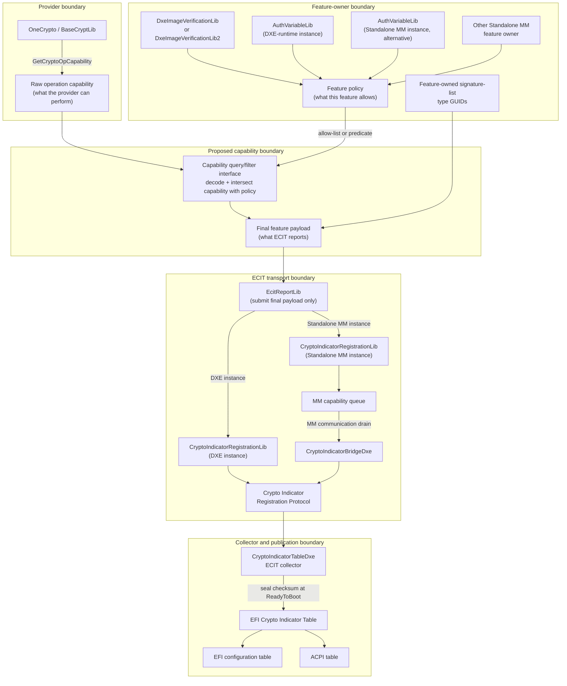

# EFI Crypto Indicator Table Reporting Flow

This document describes the current ECIT reporting infrastructure and a proposed
capability/policy split. The proposed sections are design intent only; they will
be updated or removed as the corresponding code changes land.

## Current reporting model

- `EcitReportLib` currently queries `GetCryptoOpCapability()`, allocates
  capability buffers, joins several OID-list operation payloads, and registers
  the result with the appropriate DXE or Standalone MM registration instance.
- A feature can also supply its own payload, such as the
  `EFI_SIGNATURE_LIST` type GUIDs it accepts from Secure Boot databases.
- Standalone MM feature owners queue their records locally. `CryptoIndicatorBridgeDxe`
  drains those records into the DXE collector before the table is sealed.
- The collector owns table construction, duplicate-feature rejection, length
  validation, checksum generation, and publication.

## Proposed capability and policy separation

> **Proposed.** This section describes the target split. It is not the current
> `EcitReportLib` implementation.

ECIT distinguishes three different sets:

1. **Provider capability** is the operation-specific set returned by
   `GetCryptoOpCapability()`. It reflects the linked crypto implementation and
   its configured providers.
2. **Feature policy** is the set the feature owner chooses to allow for its
   particular use. It can be stricter than provider capability because of
   Secure Boot policy, compatibility requirements, deployment policy, or a
   product profile.
3. **Reported capability** is the intersection of provider capability and
   feature policy. This is the only set published for an ECIT feature.

The capability query/filter interface will let a feature owner retrieve the
current provider-supported records, apply an allow-list or policy predicate,
and serialize the resulting allowed records as the ECIT payload. The query
result is runtime data, not a static copy of the provider's algorithm table.

The filter operates on the operation payload's defined records, not by
rewriting arbitrary bytes. The current v1 OID-list payload can therefore be
filtered by OID. A future Authenticode payload must expose structured
`(CMS digest OID, signature OID)` profiles, and its policy filter must retain
or remove complete profiles. Filtering signature OIDs alone would incorrectly
describe pure algorithms such as ML-DSA.

This keeps policy with the feature owner while preserving an honest view of
what the linked provider can do. It also makes the report stable when one
feature intentionally disallows an algorithm that another feature still uses.

## Proposed library responsibilities

| Layer | Responsibility |
| --- | --- |
| BaseCryptLib / OneCrypto | Return raw, operation-specific provider capability data. |
| Capability query/filter interface | Decode a defined operation payload, expose its records to the feature owner, apply the feature's allow-list or predicate, and serialize the allowed result. |
| Feature owner | Define and apply its own policy, then select the final payload to report. |
| `EcitReportLib` | Submit the final `(FeatureIdentifier, Payload)` pair through the DXE or Standalone MM registration path. |
| Registration and collector | Copy/queue records, reject duplicate feature IDs, seal the table, and publish it. |

## Standalone MM features

Standalone MM code cannot locate the DXE registration protocol directly. A
feature owner that runs in `MM_STANDALONE` therefore reports through the
`CryptoIndicatorRegistrationLibStandaloneMm` instance instead.

`AuthVariableLib` supports both `DXE_RUNTIME_DRIVER` and `MM_STANDALONE`.
The two `AuthVariableLib` nodes in the diagram represent phase-specific
instances of the same library class. They are alternatives for a given
platform feature, not two simultaneous reporters of the same capability.

When a platform links `AuthVariableLib` into Standalone MM with the functional
`EcitReportLib` instance, it reports the Secure Boot database-update features:

- `gEfiEcitFeatureSbDatabaseUpdateVerificationGuid` describes the
  crypto-operation algorithms used to verify authenticated database updates.
- `gEfiEcitFeatureSbDatabaseUpdateAuthorizationGuid` describes the
  `EFI_SIGNATURE_LIST` type GUIDs accepted to authorize those updates.

The MM registration library copies each feature record into MM-owned memory.
On the first successful registration it installs an MMI handler identified by
`gEcitMmBridgeHandlerGuid`. It does not publish an ECIT table and does not
write DXE memory.

At `ReadyToBoot`, `CryptoIndicatorBridgeDxe` runs at `TPL_NOTIFY`, before the
collector's `TPL_CALLBACK` sealing event. It uses
`EFI_MM_COMMUNICATION2_PROTOCOL` to request the queued records:

1. The bridge first reserves a 4 KiB payload buffer.
2. If MM reports `EFI_BUFFER_TOO_SMALL`, the bridge retries once with the
   exact required size, subject to its format limit.
3. The bridge validates the returned bridge header and each packed
   `(FeatureIdentifier, DataSize, Data)` record.
4. It registers each validated record with the DXE collector through the
   regular registration library.

The Standalone MM registration instance contains module-local static state and
installs one MMI handler. A platform must link it into only one MM module.
If multiple MM feature owners need ECIT reporting, they must report through
that module or use a platform-provided MM aggregation design.

Each feature identifier may be registered only once with the DXE collector.
Accordingly, a platform must not have both the DXE-runtime and Standalone MM
instances report the same authenticated-variable feature identifier.
