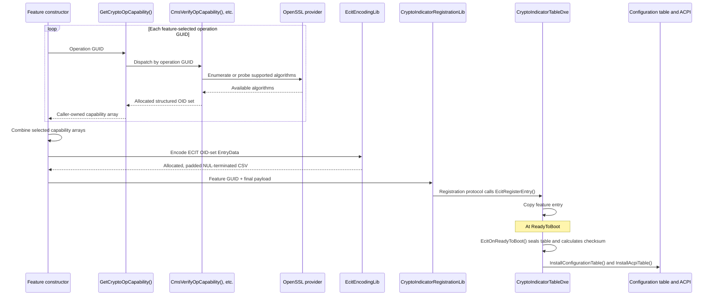
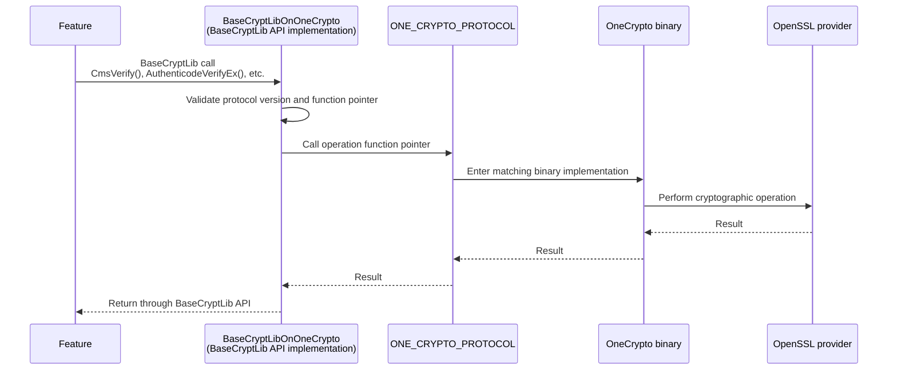
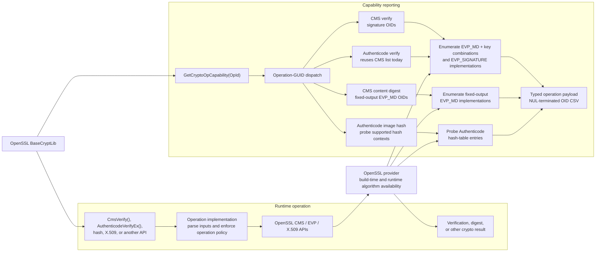
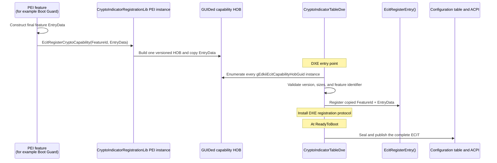

# ECIT Reporting and OneCrypto Execution Flows

This document separates two related but independent paths:

1. The **ECIT reporting path** discovers, filters, transports, and publishes
   cryptographic capability data.
2. The **CryptoPath** carries a cryptographic operation from a feature's
   `BaseCryptLib` call into the OneCrypto binary and its linked provider.

The proposed sections are design intent only; they will be updated or removed
as the corresponding code changes land.

## ECIT reporting path

This section explains how the firmware asks a crypto provider, such as OpenSSL,
what algorithms it supports and records the answer in ECIT. Four terms are
useful:

- A **provider** is the cryptographic implementation. Here, the provider is
  OpenSSL.
- An **operation** is a specific cryptographic job, such as CMS signature
  verification or PE/COFF image validation or hashing. Operation GUIDs tell
  `GetCryptoOpCapability()` which jobs are being queried.
- A **feature** is the firmware behavior that uses cryptography, such as
  authenticated-variable updates or Secure Boot image verification. A feature
  GUID identifies the ECIT entry that will receive the result.
- A **payload** is the capability data stored in that entry. The current
  crypto-operation payload is a NUL-terminated CSV of algorithm OIDs.


```mermaid
sequenceDiagram
  participant Feature as Feature constructor
  participant Query as GetCryptoOpCapability()
  participant Handler as CmsVerifyOpCapability(), etc.
  participant Provider as OpenSSL provider
  participant Encode as EcitEncodingLib
  participant Register as CryptoIndicatorRegistrationLib
  participant Collector as CryptoIndicatorTableDxe
  participant Published as Configuration table and ACPI

  loop Each feature-selected operation GUID
    Feature->>Query: Operation GUID
    Query->>Handler: Dispatch by operation GUID
    Handler->>Provider: Enumerate or probe supported algorithms
    Provider-->>Handler: Available algorithms
    Handler-->>Query: Allocated structured OID set
    Query-->>Feature: Caller-owned capability array
  end
  Feature->>Feature: Combine selected capability arrays
  Feature->>Encode: Encode ECIT OID-set EntryData
  Encode-->>Feature: Allocated, padded NUL-terminated CSV
  Feature->>Register: Feature GUID + final payload
  Register->>Collector: Registration protocol calls EcitRegisterEntry()
  Collector->>Collector: Copy feature entry
  Note over Collector: At ReadyToBoot
  Collector->>Collector: EcitOnReadyToBoot() seals table and calculates checksum
  Collector->>Published: InstallConfigurationTable() and InstallAcpiTable()
```

The call sequence is:

1. A feature constructor chooses its feature GUID and one or more operation
   GUIDs. `AuthVariableLib` chooses CMS verification.
   `DxeImageVerificationLib` chooses Authenticode verification and
   Authenticode image hashing.
2. The feature calls `GetCryptoOpCapability()` for each selected operation
   GUID. Each call returns a caller-owned structured OID array.
3. `GetCryptoOpCapability()` dispatches the operation GUID to an OpenSSL
   BaseCryptLib handler such as `CmsVerifyOpCapability()` or
   `AuthenticodeHashOpCapability()`.
4. The feature combines the arrays and uses `EcitEncodingLib` to remove
   duplicate OIDs and encode the specification-required NUL-terminated CSV
   with zero padding to an 8-byte boundary. The feature calls
   `EcitRegisterCryptoCapability()` with its feature GUID and completed
   EntryData, then releases both allocations with `FreePool()`.
5. In DXE, the registration library submits the entry through the collector's
   registration protocol. In Standalone MM, it queues the entry;
   `CryptoIndicatorBridgeDxe` later drains the queue into the same DXE
   registration path. A PEI instance of `CryptoIndicatorRegistrationLib` writes the
   completed record to a GUIDed HOB, which the collector imports when its DXE
   driver starts.
6. The collector's `EcitRegisterEntry()` copies every feature entry, regardless
   of its phase-specific transport. At
   `ReadyToBoot`, `EcitOnReadyToBoot()` seals the table, calculates its
   checksum, and publishes it through both the EFI configuration table and
   ACPI.

## Operation mappings and current limitations

- BaseCryptLib exposes four typed operation queries:

  | Operation | OIDs returned | Selected by |
  | --- | --- | --- |
  | `gCryptoOpCmsVerifyGuid` | CMS signature algorithms | `AuthVariableLib` |
  | `gCryptoOpCmsContentDigestGuid` | CMS `SignedData.digestAlgorithms` | None in this branch |
  | `gCryptoOpAuthenticodeVerifyGuid` | Authenticode signature algorithms | `DxeImageVerificationLib` |
  | `gCryptoOpAuthenticodeHashGuid` | PE/COFF image-digest algorithms | `DxeImageVerificationLib` |

- Each feature selects its operation GUIDs and calls
  `GetCryptoOpCapability()`. The feature combines compatible operation
  capability sets, and `EcitEncodingLib` encodes the ECIT EntryData.
  `CryptoIndicatorRegistrationLib` transports the completed opaque payload
  through its phase-specific instance.
- `gCryptoOpCmsContentDigestGuid` is implemented, exposed through OneCrypto,
  and covered by BaseCryptLib unit tests. The current `AuthVariableLib` wiring
  in this branch selects only the CMS signature-verification operation, so the
  CMS content-digest list does not yet reach an ECIT feature payload.
- `DxeImageVerificationLib` selects both the Authenticode signature-verification
  operation and the PE/COFF image-hash operation. ECIT v1 requires one
  unordered CSV OID set, so the two sets are unioned and deduplicated. This
  encoding loses the different algorithm roles.
- `AuthenticodeVerifyOpCapability()` currently delegates directly to
  `CmsVerifyOpCapability()`. The separate operation GUID preserves the boundary
  at which Authenticode-specific profile restrictions can be applied later.
- A feature can also supply its own payload, such as the
  `EFI_SIGNATURE_LIST` type GUIDs it accepts from Secure Boot databases.
- Standalone MM feature owners queue their records locally. `CryptoIndicatorBridgeDxe`
  drains those records into the DXE collector before the table is sealed.
- The collector owns table construction, duplicate-feature rejection, length
  validation, checksum generation, and publication.

## CryptoPath: BaseCryptLib into OneCrypto

Features do not locate or call `ONE_CRYPTO_PROTOCOL` directly. They call the
stable `BaseCryptLib` API, and the platform DSC selects the phase-appropriate
`BaseCryptLibOnOneCrypto` instance. The library instance and the OneCrypto
loader meet at the protocol boundary.

This diagram answers one question: **where does a feature's BaseCryptLib call
execute?**


```mermaid
sequenceDiagram
  participant Feature as Feature
  participant Adapter as BaseCryptLibOnOneCrypto<br/>(BaseCryptLib API implementation)
  participant Protocol as ONE_CRYPTO_PROTOCOL
  participant Binary as OneCrypto binary
  participant OpenSSL as OpenSSL provider

  Feature->>Adapter: BaseCryptLib call<br/>CmsVerify(), AuthenticodeVerifyEx(), etc.
  Adapter->>Adapter: Validate protocol version and function pointer
  Adapter->>Protocol: Call operation function pointer
  Protocol->>Binary: Enter matching binary implementation
  Binary->>OpenSSL: Perform cryptographic operation
  OpenSSL-->>Binary: Result
  Binary-->>Protocol: Result
  Protocol-->>Adapter: Result
  Adapter-->>Feature: Return through BaseCryptLib API
```

Before the first call:

1. The loader loads the OneCrypto binary, calls its exported entry point, and
   allocates a `ONE_CRYPTO_PROTOCOL` structure.
2. `CryptoInit()` fills that structure with the binary's linked
   `BaseCryptLib` and `TlsLib` function addresses.
3. The loader publishes the structure under `gOneCryptoProtocolGuid` in DXE,
   SMM, or Standalone MM.
4. The selected `BaseCryptLibOnOneCrypto` constructor locates the protocol and
   stores it in `gCryptoProtocol`.
5. Each public `BaseCryptLib` wrapper validates the required protocol version
   and function pointer before making the indirect call into the binary.

The function with the same name on each side of the protocol is not a
recursive call. The caller-side symbol is the `BaseCryptLibOnOneCrypto`
wrapper; the protocol function pointer targets the implementation linked into
the separately built OneCrypto binary.

`GetCryptoOpCapability()` follows this same CryptoPath. Its result describes
what the linked provider can perform for an operation; it does not select the
algorithm used by an individual CMS, Authenticode, or image-hash verification.
That selection occurs when the feature invokes the corresponding runtime
operation through `BaseCryptLib`.

## OpenSSL BaseCryptLib implementation

This diagram expands the OpenSSL end of the CryptoPath. It answers one
question: **what does the OpenSSL BaseCryptLib implementation do with runtime
and capability-reporting calls?**


```mermaid
flowchart LR
  Entry["OpenSSL BaseCryptLib"]

  subgraph Runtime["Runtime operation"]
    RuntimeApi["CmsVerify(), AuthenticodeVerifyEx(),<br/>hash, X.509, or another API"]
    RuntimeImplementation["Operation implementation<br/>parse inputs and enforce operation policy"]
    EvpOperation["OpenSSL CMS / EVP / X.509 APIs"]
    RuntimeResult["Verification, digest,<br/>or other crypto result"]

    RuntimeApi --> RuntimeImplementation --> EvpOperation
  end

  subgraph Capability["Capability reporting"]
    GetCapability["GetCryptoOpCapability(OpId)"]
    Dispatch["Operation-GUID dispatch"]

    CmsVerify["CMS verify<br/>signature OIDs"]
    CmsDigest["CMS content digest<br/>fixed-output EVP_MD OIDs"]
    AuthVerify["Authenticode verify<br/>reuses CMS list today"]
    AuthHash["Authenticode image hash<br/>probe supported hash contexts"]

    SignatureEnumeration["Enumerate EVP_MD + key combinations<br/>and EVP_SIGNATURE implementations"]
    DigestEnumeration["Enumerate fixed-output<br/>EVP_MD implementations"]
    HashProbe["Probe Authenticode<br/>hash-table entries"]
    OidPayload["Typed operation payload<br/>NUL-terminated OID CSV"]

    GetCapability --> Dispatch
    Dispatch --> CmsVerify --> SignatureEnumeration
    Dispatch --> AuthVerify --> SignatureEnumeration
    Dispatch --> CmsDigest --> DigestEnumeration
    Dispatch --> AuthHash --> HashProbe
    SignatureEnumeration --> OidPayload
    DigestEnumeration --> OidPayload
    HashProbe --> OidPayload
  end

  Provider["OpenSSL provider<br/>build-time and runtime algorithm availability"]

  Entry --> RuntimeApi
  Entry --> GetCapability
  EvpOperation --> Provider
  Provider --> RuntimeResult
  Provider --> SignatureEnumeration
  Provider --> DigestEnumeration
  Provider --> HashProbe
```

The two branches answer different questions:

- The **runtime branch** processes a particular CMS message, image, key,
  certificate, or buffer and returns the result of that operation.
- The **capability branch** does not process a caller's artifact. It dispatches
  an operation GUID, enumerates or probes the algorithms usable by that
  operation, and returns their OIDs.

For signature reporting, BaseCryptLib combines OpenSSL's legacy
digest-plus-key signature mappings with algorithms exposed directly through
`EVP_SIGNATURE`. `AuthenticodeVerifyOpCapability()` currently returns the same
signature list as `CmsVerifyOpCapability()`, while
`AuthenticodeHashOpCapability()` separately probes the digest implementations
used to hash PE/COFF images.

`CmsContentDigestOpCapability()` enumerates fixed-output `EVP_MD`
implementations for CMS `SignedData.digestAlgorithms`. BaseCryptLib exposes
that typed list, but the current SecurityPkg feature wiring in this branch does
not select it for an ECIT entry.

## Proposed capability and policy separation

> **Proposed.** This section describes the target capability-policy split.

ECIT distinguishes three different sets:

1. **Provider capability** is the operation-specific set returned by
   `GetCryptoOpCapability()`. It reflects the linked crypto implementation and
   its configured providers.
2. **Feature policy** is the set the feature owner chooses to allow for its
   particular use. It can be stricter than provider capability because of
   Secure Boot policy, compatibility requirements, deployment policy, or a
   product profile.
3. **Reported capability** is the intersection of provider capability and
   feature policy. This is the only set published for an ECIT feature.

The capability query/filter interface will let a feature owner retrieve the
current provider-supported records, apply an allow-list or policy predicate,
and serialize the resulting allowed records as the ECIT payload. The query
result is runtime data, not a static copy of the provider's algorithm table.

The filter operates on the operation payload's defined records, not by
rewriting arbitrary bytes. The current v1 OID-list payload can therefore be
filtered by OID. A future Authenticode payload must expose structured
`(CMS digest OID, signature OID)` profiles, and its policy filter must retain
or remove complete profiles. Filtering signature OIDs alone would incorrectly
describe pure algorithms such as ML-DSA.

This keeps policy with the feature owner while preserving an honest view of
what the linked provider can do. It also makes the report stable when one
feature intentionally disallows an algorithm that another feature still uses.

## Proposed library responsibilities

| Layer | Responsibility |
| --- | --- |
| BaseCryptLib / OneCrypto | Return raw, operation-specific provider capability data. |
| Capability query/filter interface | Decode a defined operation payload, expose its records to the feature owner, apply the feature's allow-list or predicate, and serialize the allowed result. |
| Feature owner | Define and apply its own policy, then select the final payload to report. |
| `CryptoIndicatorRegistrationLib` | Submit the final `(FeatureIdentifier, Payload)` pair through the phase-specific DXE, Standalone MM, or PEI HOB transport. |
| Collector | Import/copy records, reject duplicate feature IDs, seal the table, and publish it. |

## PEI features

PEI features such as Intel Boot Guard finish before the DXE registration
protocol exists. They report through a GUIDed HOB that
`CryptoIndicatorTableDxe` imports when the collector starts.

The feature-facing API does not change across phases. A PEIM links the PEI
instance of `CryptoIndicatorRegistrationLib` and reports completed,
feature-typed EntryData:

```c
Status = EcitRegisterCryptoCapability (
           &gEfiEcitFeatureBootGuardGuid,
           EntryData,
           EntryDataSize
           );
```

The PEI instance validates the arguments, allocates one
`gEdkiiEcitCapabilityHobGuid` HOB, and copies the feature identifier and
EntryData into it. Each call produces one HOB, so multiple PEI features can
report independently without sharing mutable state.

The HOB contains transport metadata and EntryData, not a serialized
`EFI_CRYPTO_INDICATOR_ENTRY`:

```c
#define EDKII_ECIT_CAPABILITY_HOB_REVISION  1

typedef struct {
  UINT16      Revision;
  UINT16      HeaderSize;
  UINT32      EntryDataSize;
  EFI_GUID    FeatureIdentifier;
  // UINT8    EntryData[];
} EDKII_ECIT_CAPABILITY_HOB;
```

`HeaderSize` permits compatible extension of the transport header. EntryData
begins at `HeaderSize`, and `EntryDataSize` does not include the header.
The collector, rather than the PEI producer, remains responsible for
`EFI_CRYPTO_INDICATOR_ENTRY.EntryLength`, reserved fields, table layout, and
the final checksum.


```mermaid
sequenceDiagram
  participant PeiFeature as PEI feature<br/>(for example Boot Guard)
  participant PeiReport as CryptoIndicatorRegistrationLib PEI instance
  participant Hob as GUIDed capability HOB
  participant Collector as CryptoIndicatorTableDxe
  participant Register as EcitRegisterEntry()
  participant Published as Configuration table and ACPI

  PeiFeature->>PeiFeature: Construct final feature EntryData
  PeiFeature->>PeiReport: EcitRegisterCryptoCapability(FeatureId, EntryData)
  PeiReport->>Hob: Build one versioned HOB and copy EntryData
  Note over Collector: DXE entry point
  Collector->>Hob: Enumerate every gEdkiiEcitCapabilityHobGuid instance
  Collector->>Collector: Validate version, sizes, and feature identifier
  Collector->>Register: Register copied FeatureId + EntryData
  Note over Collector: Install DXE registration protocol
  Note over Collector: At ReadyToBoot
  Collector->>Published: Seal and publish the complete ECIT
```

`CryptoIndicatorTableDxe` imports all matching HOB instances before installing
`gEfiCryptoIndicatorRegistrationProtocolGuid`. For each HOB it must:

1. Validate that the GUID HOB data is large enough for the fixed header.
2. Require the supported `Revision` and a `HeaderSize` that is at least the
   fixed header and no larger than the HOB data.
3. Validate that `EntryDataSize` exactly fits in the remaining HOB data without
   overflow and that the resulting ECIT entry fits `UINT16 EntryLength`.
4. Reject an invalid or zero feature identifier.
5. Pass the feature identifier and EntryData through `EcitRegisterEntry()` so
   PEI records use the same copy, count, size, and duplicate checks as DXE and
   Standalone MM records.

Malformed, unsupported, duplicate, or uncopyable PEI records are reporting
integrity failures. The collector must log the specific HOB and status and
must not silently publish a table that appears complete while omitting that
record. A PEI producer only learns whether HOB creation succeeded; import
failures are therefore diagnosed by the DXE collector.

Feature identifiers remain globally unique across every phase. Importing PEI
records before protocol installation gives early-boot features deterministic
ownership. A later DXE or Standalone MM attempt to report the same feature is
rejected with `EFI_ALREADY_STARTED`; platforms should select exactly one owner
for each feature.

PEI modules that implement crypto-backed features should use ECIT to report
their cryptographic capabilities. For example, the PEI module that owns Boot
Guard constructs the EntryData required by its ECIT feature schema and calls
`EcitRegisterCryptoCapability()`.

## Standalone MM features

Standalone MM code cannot locate the DXE registration protocol directly. A
feature owner that runs in `MM_STANDALONE` therefore reports through the
`CryptoIndicatorRegistrationLibStandaloneMm` instance instead.

`AuthVariableLib` supports both `DXE_RUNTIME_DRIVER` and `MM_STANDALONE`.
The two `AuthVariableLib` nodes in the diagram represent phase-specific
instances of the same library class. They are alternatives for a given
platform feature, not two simultaneous reporters of the same capability.

When a platform links `AuthVariableLib` into Standalone MM with the functional
`CryptoIndicatorRegistrationLib` instance, it reports the Secure Boot
database-update features:

- `gEfiEcitFeatureSbDatabaseUpdateVerificationGuid` describes the
  crypto-operation algorithms used to verify authenticated database updates.
- `gEfiEcitFeatureSbDatabaseUpdateAuthorizationGuid` describes the
  `EFI_SIGNATURE_LIST` type GUIDs accepted to authorize those updates.

The MM registration library copies each feature record into MM-owned memory.
On the first successful registration it installs an MMI handler identified by
`gEcitMmBridgeHandlerGuid`. It does not publish an ECIT table and does not
write DXE memory.

At `ReadyToBoot`, `CryptoIndicatorBridgeDxe` runs at `TPL_NOTIFY`, before the
collector's `TPL_CALLBACK` sealing event. It uses
`EFI_MM_COMMUNICATION2_PROTOCOL` to request the queued records:

1. The bridge first reserves a 4 KiB payload buffer.
2. If MM reports `EFI_BUFFER_TOO_SMALL`, the bridge retries once with the
   exact required size, subject to its format limit.
3. The bridge validates the returned bridge header and each packed
   `(FeatureIdentifier, DataSize, Data)` record.
4. It registers each validated record with the DXE collector through the
   regular registration library.

The Standalone MM registration instance contains module-local static state and
installs one MMI handler. A platform must link it into only one MM module.
If multiple MM feature owners need ECIT reporting, they must report through
that module or use a platform-provided MM aggregation design.

Each feature identifier may be registered only once with the DXE collector.
Accordingly, a platform must not have both the DXE-runtime and Standalone MM
instances report the same authenticated-variable feature identifier.
