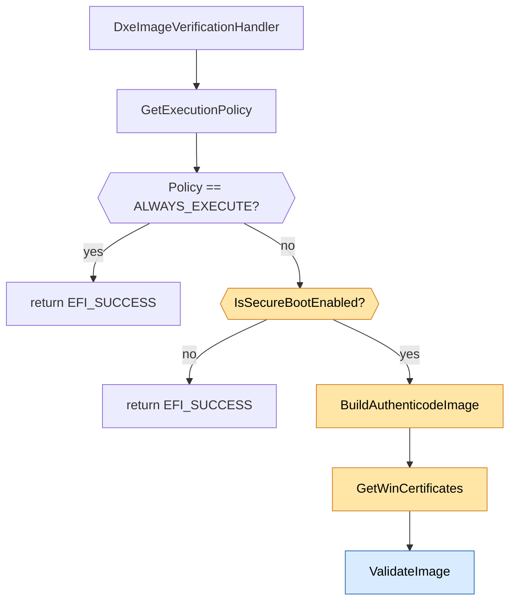
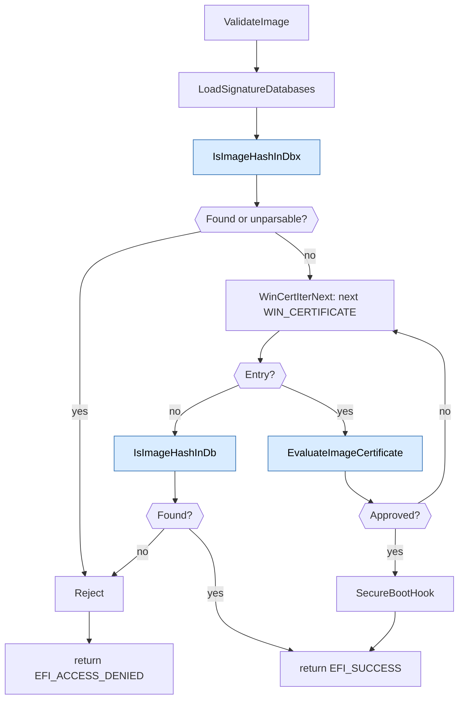
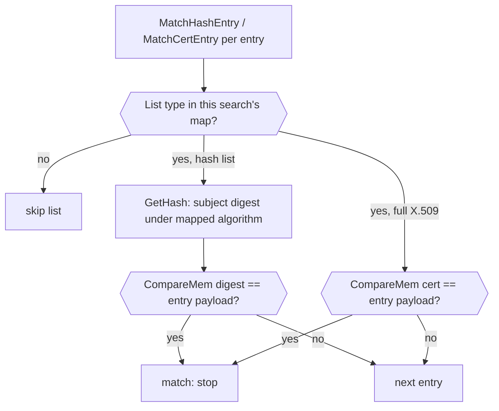
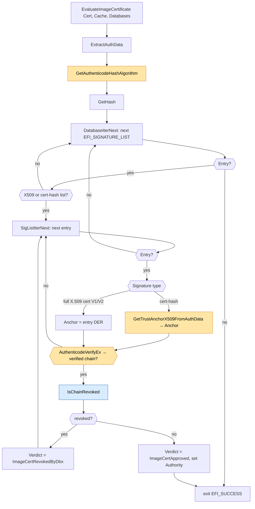
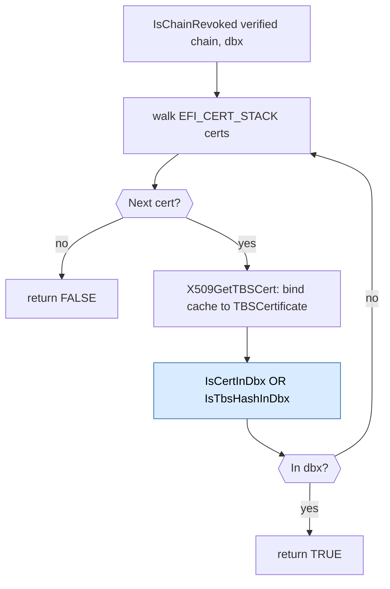

# DxeImageVerificationHandler Flow

This document describes the runtime flow of
`DxeImageVerificationHandler` in `SecurityPkg/Library/DxeImageVerificationLib2`.
It focuses on the following phases:

1. **Policy validation** (entry-point gating)
2. **`ValidateImage`** (the single, unified validator for both signed
   and unsigned images)
3. Image allow / deny list search
4. Per-certificate allow / deny list search

## About this library

`DxeImageVerificationLib` is a `NULL` library: it has no public class
interface. Linking it into a module runs its constructor, which
registers `DxeImageVerificationHandler` with the platform's Security2
architectural protocol. From then on, every image the DXE core loads is
routed through that handler, which returns `EFI_SUCCESS` to permit
execution or `EFI_ACCESS_DENIED` to block it.

### Recording the outcome

Image status reporting is done through the config table called
`EFI_IMAGE_SECURE_BOOT_VERIFICATION_RESULT_TABLE`. This table records the
overall status of the image and the status of the individual signatures
in the image that were evaluated.

### Measuring the outcome

When an image is authorized **by a certificate**, the authorizing certificate
is measured into **PCR 7** via `SecureBootHook`, The certificate is wrapped in
a constructed V1 `EFI_SIGNATURE_DATA` structure. If a TBS certificate hash was
the `db` entry that authorized the image, the derived certificate is the
recorded data, not the hash itself. Images authorized **by image hash** are not
measured. Each distinct authority is measured **at most once per boot**: the
handler tracks the set of already-measured authorities and skips any it has
seen before, so loading many images authorized by the same certificate extends
PCR 7 only once for that authority.

> **Diagram conventions**
>
> - **Yellow** nodes are functions provided by external **library
>   classes** (e.g. `BaseCryptLib`, `SecureBootVariableLib`).
> - **Blue** nodes are functions owned by this library that are
>   **expanded in a later section**.
> - For simplicity the diagrams assume the setup calls (iterator init,
>   database load, etc.) neither truncate nor fail; the early-abort
>   branches are omitted.

## 1. Top-level flow

Notes:

- `GetExecutionPolicy` runs **before** the Secure Boot check because
  it is cheap *and* the FV-dispatched-driver fast path (policy =
  `ALWAYS_EXECUTE`) is by far the most common path. Short-circuiting
  there avoids the Secure Boot variable read and PE/COFF parse for the
  majority of invocations.
- If Secure Boot is disabled the handler returns `EFI_SUCCESS` without
  inspecting the image.
- The handler assembles the Authenticode image (`BuildAuthenticodeImage`)
  and locates the embedded `WIN_CERTIFICATE` table (`GetWinCertificates`)
  via `AuthenticodeLib`. Both operations consume the original `FileBuffer` /
  `FileSize`; the handler then passes the resulting `AuthImage` /
  `AuthImageSize` and `WinCertificates` / `WinCertificatesLength` directly to
  `ValidateImage`. A failure to parse the image in either operation is treated
  as a verification failure.
- `AuthImage` is a pool allocation owned and freed by the handler.
  `WinCertificates` is a borrowed pointer into the original `FileBuffer` and
  must not be freed. `ValidateImage` neither owns these buffers nor reparses the
  original PE/COFF image.
- There is **one** authorizer. `ValidateImage` handles both signed and
  unsigned images; an unsigned image simply has an empty `WIN_CERTIFICATE`
  table, so the iterator is empty.

## 2. `ValidateImage`

`ValidateImage` orchestrates three steps against a shared
`DIGEST_CACHE`:

1. **Image-hash revocation.** Look up the image's Authenticode digest
   in `dbx` via `IsImageHashInDbx`. A hit - or a `dbx` that cannot be fully
   parsed (fail-closed) - rejects the image.
2. **Per-`WIN_CERTIFICATE` walk.** For each embedded `WIN_CERTIFICATE`,
   ask `EvaluateImageCertificate` for a verdict; the first certificate
   whose verdict is `ImageCertApproved` authorizes the image.
3. **Image-hash fallback.** If no embedded signature authorizes the
   image, look up the image's digest in `db` via `IsImageHashInDb`. A hit
   authorizes on the image-hash path.

When the image is authorized by a certificate, the authorizing certificate
is measured into PCR 7 via `SecureBootHook` and the function returns
`EFI_SUCCESS`; image-hash authorizations are not measured. When the image is
rejected, the function simply returns `EFI_ACCESS_DENIED`.

Notes:

- `dbx` is consulted **before** the certificate walk and the `db`
  hash fallback. A revoked image hash is denied regardless of any
  certificates.
- The first `WIN_CERTIFICATE` that authorizes wins; the walk is empty
  when `WinCertificates == NULL` and `WinCertificatesLength == 0`, so an
  unsigned image can only be authorized by the `db` image-hash fallback.
- Only certificate authorization flows through `SecureBootHook`; an image-hash
  authorization returns success without measuring an authority into PCR 7.

## 3. Hash- and certificate-membership searches

A family of `WalkDatabase`-driven searches decide whether a subject is present
in a `db` (allow-list) or `dbx` (deny-list). Each search matches only one
family of `EFI_SIGNATURE_LIST` signature types, so the caller picks the wrapper
that fits the subject:

| Wrapper | Subject | Signature types matched |
| --- | --- | --- |
| `IsImageHashInDb` / `IsImageHashInDbx` | Authenticode image digest (cache) | `gEfiCert<V2><HASH>Guid` |
| `IsTbsHashInDb` / `IsTbsHashInDbx` | X.509 TBSCertificate digest (cache) | `gEfiCert<V2>X509<HASH>Guid` |
| `IsCertInDbx` | Raw DER certificate (bytes) | `gEfiCert<V2>X509Guid` |

The hash searches take a `DIGEST_CACHE` bound to the subject's bytes and compute
the digest on demand via `GetHash` (memoized per algorithm). `IsCertInDbx` takes
the raw certificate and compares it byte-for-byte, so it needs no cache.

A static map (`mImageHashSignatures`, `mTbsHashSignatures`, `mX509CertSignatures`)
pairs each supported signature type with the algorithm to hash the subject under
and the per-entry `SignatureOwner` size (`sizeof (EFI_GUID)` for a V1
`EFI_SIGNATURE_DATA`, 0 for a V2 `EFI_SIGNATURE_V2_DATA`). A visitor
(`MatchHashEntry` or `MatchCertEntry`) consults the map for the current list's
type and skips any list whose type it does not carry.

`db` and `dbx` differ only in how they treat an incomplete walk:

- **`db` (allow-list, best-effort).** Ignores truncation and honors the valid
  prefix: dropped entries can only remove a potential authorizer, never add one.
  Returns TRUE if the subject is present, otherwise FALSE.
- **`dbx` (deny-list, fail-closed).** Returns TRUE if a matching entry is found
  **or** the walk could not be completed (a structural break, or a supported
  list whose digest could not be computed), because a dropped entry might have
  matched the subject.

Callers: `ValidateImage` uses `IsImageHashInDbx` (revocation) and
`IsImageHashInDb` (allow-list fallback); `IsChainRevoked` uses `IsCertInDbx` and
`IsTbsHashInDbx` per chain certificate.

## 4. `EvaluateImageCertificate`

Evaluates a single `WIN_CERTIFICATE` and reports a verdict as an
`IMAGE_CERT_EVALUATION` out-parameter. The `EFI_STATUS` return indicates
whether evaluation could be performed; the security outcome is the verdict.

`EvaluateImageCertificate` extracts the `AuthData` from the `WIN_CERTIFICATE`
then walks the `db`. This `db` walk supports both X509 and X509 hash signature
list signature types. When the signature list signature type is an X509 hash,
the underlying X509 is derived; then in both scenarios, the X509 bytes are
searched for in the signature list. On a match, the chain from signer to the
matched X509 is extracted. Each X509 in the chain is searched for in the `dbx`
by exact DER via `IsCertInDbx` and, after extracting its TBSCertificate, by its
TBS-cert hash via `IsTbsHashInDbx`.

Ultimetly, if a certificate is found in the `db` and nothing in the chain
between signer and the certificate is found in the `dbx`, then the signature
authorizes the image to execute. Otherwise the search in the `db` will continue.

The verdict (`Evaluation->Verdict`) is one of:

| Verdict | Meaning |
| --- | --- |
| `ImageCertApproved` | A `db` anchor verified the image with an un-revoked chain. `Evaluation->Authority` wraps the authorizing certificate (an owned V1 `EFI_SIGNATURE_DATA`) for PCR 7 measurement. |
| `ImageCertRevokedByDbx` | A `db` anchor verified the image, but a certificate in its verified chain is enrolled in `dbx`, and no other anchor authorizes it. |
| `ImageCertNotInDb` | No `db` anchor verifies the image. |
| `ImageCertUnusable` | The certificate could not be evaluated before trust-anchor processing: unsupported `WIN_CERTIFICATE` type, malformed PKCS#7, or unrecognized hash algorithm. |

Evaluation is only valid if the return is `EFI_SUCCESS`. Any `EFI_ERROR`
indicates that there was an error and the Evaluation cannot be trusted.[8-5]

### 4a. `IsChainRevoked`

Decides whether the certificate chain that authorizes the image is revoked
by `dbx`. It consumes the `EFI_CERT_STACK` returned by the successful
`AuthenticodeVerifyEx` call and reports the chain as revoked if **any**
certificate in it is enrolled in the `dbx` - matched either by exact DER via
`IsCertInDbx` or by its TBSCertificate digest via `IsTbsHashInDbx` (3). The
TBSCertificate is extracted once per certificate (via `X509GetTBSCert`) and
bound to a fresh `DIGEST_CACHE` before the hash search. Using
the verifier-produced chain ensures the revocation decision applies to the
exact chain that authorized the image.

It fails **closed**: a missing or malformed chain buffer returns TRUE
(revoked). An absent/empty `dbx` returns FALSE (nothing to revoke against).

