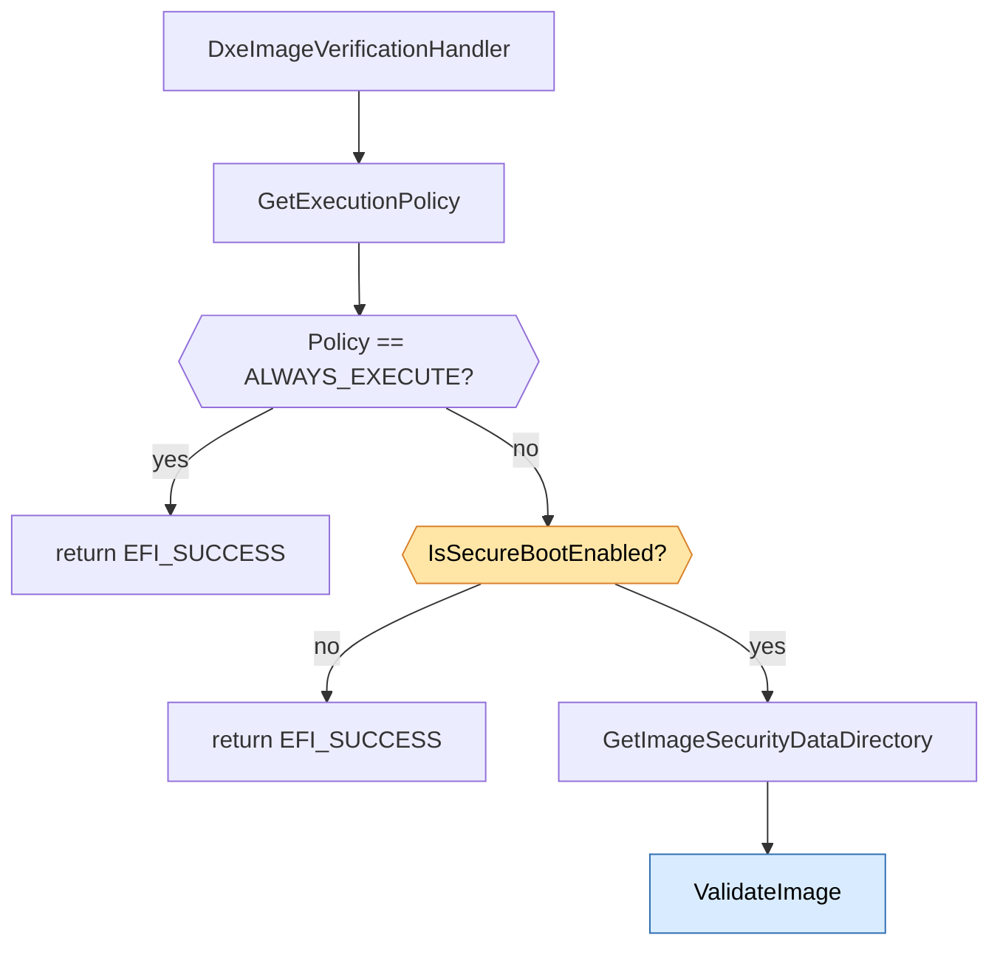
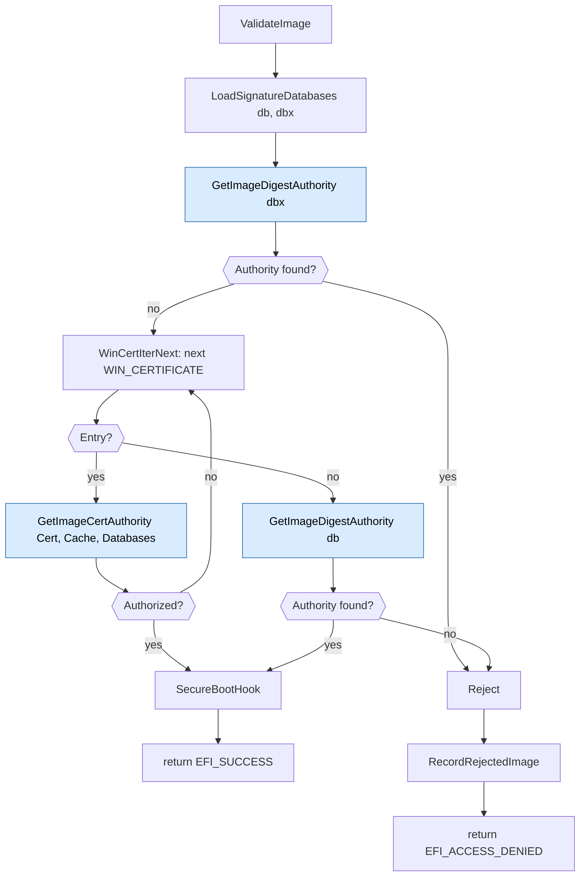
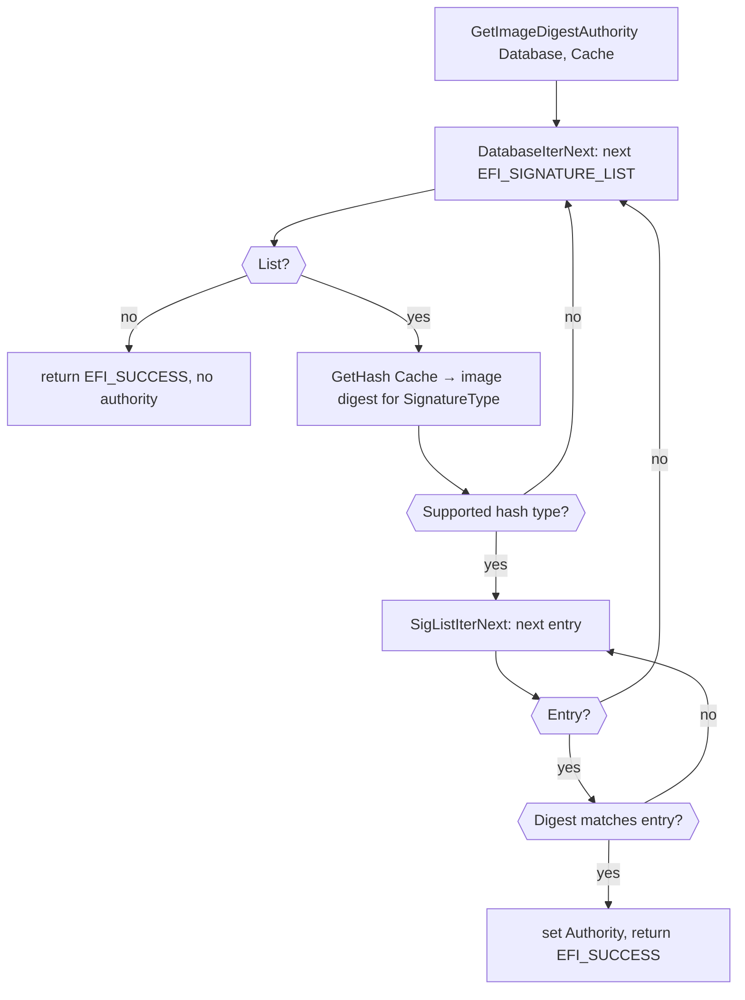
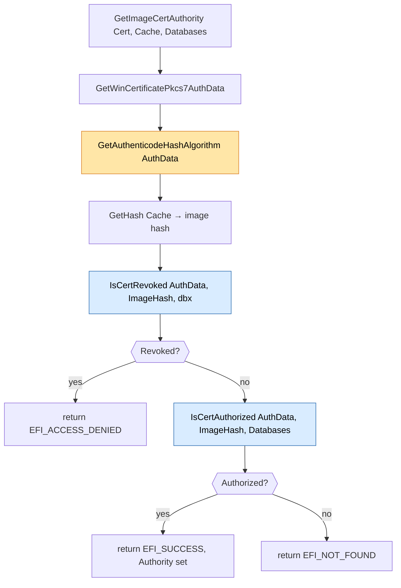
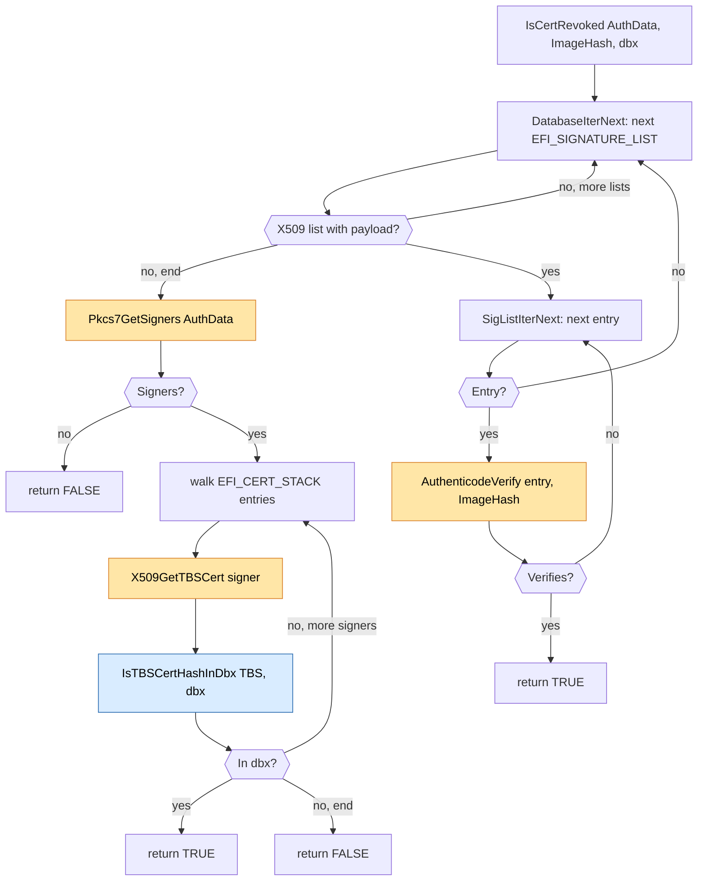
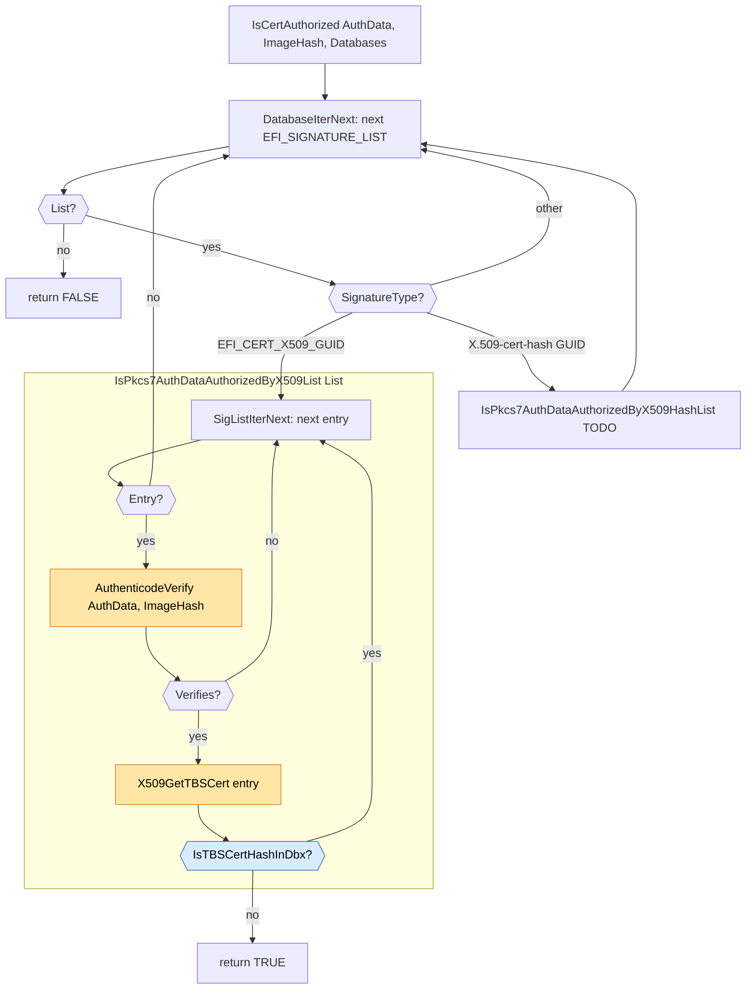
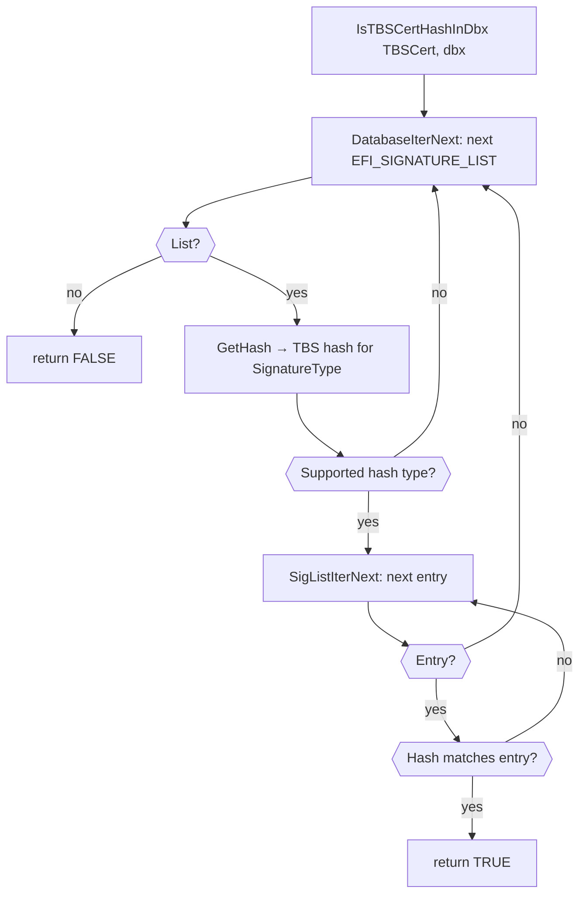

# DxeImageVerificationHandler Flow

This document describes the runtime flow of
`DxeImageVerificationHandler` in `SecurityPkg/Library/DxeImageVerificationLib2`.
It focuses on the following phases:

1. **Policy validation** (entry-point gating)
2. **`ValidateImage`** (the single, unified validator for both signed
   and unsigned images)
3. The helpers `ValidateImage` drives — `GetImageDigestAuthority`
   (image-hash lookup) and `GetImageCertAuthority` (per-certificate
   evaluation, which in turn drives `IsCertRevoked` / `IsCertAuthorized`)

`ValidateImage` builds a single `DIGEST_CACHE` bound to the image and
threads it through every step, so each Authenticode digest is computed
at most once per algorithm regardless of how many `db` / `dbx` lists or
signatures are visited.

## About this library

`DxeImageVerificationLib` is a `NULL` library: it has no public class
interface. Linking it into a module runs its constructor, which
registers `DxeImageVerificationHandler` with the platform's Security2
architectural protocol. From then on, every image the DXE core loads is
routed through that handler, which returns `EFI_SUCCESS` to permit
execution or `EFI_ACCESS_DENIED` to block it.

### Recording the outcome

Each rejection is also reported to the OS through the
`EFI_IMAGE_EXECUTION_INFO_TABLE`, a UEFI configuration table published
under `gEfiImageSecurityDatabaseGuid`. Every rejected image appends one
entry whose `EFI_IMAGE_EXECUTION_ACTION` records *why* it was rejected:

| Action | Meaning |
| --- | --- |
| `EFI_IMAGE_EXECUTION_AUTH_UNTESTED` | Unsigned image that was not authorized. |
| `EFI_IMAGE_EXECUTION_AUTH_SIG_FOUND` | Signed image whose Authenticode hash is enrolled in `dbx`. |
| `EFI_IMAGE_EXECUTION_AUTH_SIG_FAILED` | Signed image with at least one certificate revoked by `dbx` (or otherwise un-evaluable). |
| `EFI_IMAGE_EXECUTION_AUTH_SIG_NOT_FOUND` | Signed image with no certificate in `db` and whose hash is not in `db`. |

The `SIG_*` actions apply to **signed** images (those carrying a
`WIN_CERTIFICATE`). An **unsigned** image (`SecDataDir.Size == 0`) that
is rejected is *always* recorded as `EFI_IMAGE_EXECUTION_AUTH_UNTESTED`,
regardless of which step denied it — the signed-image reasoning above is
overridden for the unsigned case. The table is written **only on
rejection**; an authorized image produces no entry.

For the `SIG_FOUND` and `SIG_FAILED` cases the recorded entry also
carries the image digest (wrapped as an `EFI_SIGNATURE_LIST`) so the OS
can identify the offending image; the other cases record no signature.

### Measuring the outcome

When an image *is* authorized, the `db` entry that authorized it is
measured into **PCR 7** via `SecureBootHook`. To keep the PCR
measurement faithful to UEFI Secure Boot semantics, each distinct
authority is measured **at most once per boot**: the handler tracks the
set of already-measured authorities and skips any it has seen before, so
loading many images authorized by the same `db` entry extends PCR 7 only
once for that entry. Authorization (and therefore measurement) never
writes the Image Execution Information Table.

> **Diagram conventions**
>
> - **Yellow** nodes are functions provided by external **library
>   classes** (e.g. `BaseCryptLib`, `SecureBootVariableLib`).
> - **Blue** nodes are functions owned by this library that are
>   **expanded in a later section**.
> - For simplicity the diagrams assume infallible setup calls (iterator
>   init, database load, etc.); the early-abort-on-error branches are
>   omitted.

## 1. Top-level flow

Key observations:

- `GetExecutionPolicy` runs **before** the Secure Boot check because
  it is cheap *and* the FV-dispatched-driver fast path (policy =
  `ALWAYS_EXECUTE`) is by far the most common path - so short-circuiting
  there avoids the Secure Boot variable read and PE/COFF parse for the
  overwhelming majority of invocations.
- If Secure Boot is disabled the handler returns `EFI_SUCCESS` without
  inspecting the image. (Audit mode has been removed, so there is no
  longer a code path that inspects the image when Secure Boot is off.)
- A PE/COFF parse failure in `GetImageSecurityDataDirectory` is treated
  as a verification failure (its status is returned).
- There is **one** validator. `ValidateImage` handles both signed and
  unsigned images; a `SecDataDir.Size == 0` simply yields an empty
  `WIN_CERTIFICATE` walk in step 2.

## 2. `ValidateImage`

`ValidateImage` orchestrates three steps against a shared
`DIGEST_CACHE`:

1. **Image-hash revocation.** Look up the image's Authenticode digest
   in `dbx` via `GetImageDigestAuthority`. A hit rejects the image.
2. **Per-`WIN_CERTIFICATE` walk.** For each embedded `WIN_CERTIFICATE`,
   ask `GetImageCertAuthority` whether that certificate authorizes the
   image. The first certificate that authorizes wins.
3. **Image-hash fallback.** If no embedded signature authorizes the
   image, look up the image's digest in `db`. A hit authorizes on the
   image-hash path.

When the image is authorized, the authorizing `db` entry is measured
into PCR 7 via `SecureBootHook` and the function returns `EFI_SUCCESS`
**without** writing the Image Execution Information Table.

When the image is rejected, `RecordRejectedImage` appends an entry to
the Image Execution Information Table and the function returns
`EFI_ACCESS_DENIED`.

Rules of thumb:

- `dbx` is consulted **before** the certificate walk and the `db`
  hash fallback. A revoked image hash is denied regardless of `db`.
- The first `WIN_CERTIFICATE` that authorizes wins; the walk is empty
  for an unsigned image (`SecDataDir.Size == 0`), so such an image can
  only be authorized by the `db` image-hash fallback.

> The classification of *why* an image was rejected (the
> `EFI_IMAGE_EXECUTION_ACTION` recorded into the Image Execution
> Information Table) is intentionally omitted from this overview. See
> the `ValidateImage` implementation for those details.

## 3. `GetImageDigestAuthority`

Image-hash lookup against a single database buffer (used for both the
`dbx` revocation check and the `db` fallback). It walks every
`EFI_SIGNATURE_LIST` in the buffer; for each list it asks `GetHash` for
the image digest under that list's `SignatureType` (memoized in
`Cache`), then byte-compares that digest against every entry in the
list. The first matching entry is reported on `Authority` (including the
list's `SignatureType`).

An empty database (`Database == NULL` / `DatabaseSize == 0`) is treated
as a successful no-match, not an error. A list whose `SignatureType` is
not a supported image-hash algorithm (`GetHash` returns
`EFI_UNSUPPORTED`) is skipped.

The diagram below assumes `DatabaseIterInit` / `SigListIterInit`
succeed; on a `GetHash` failure other than `EFI_UNSUPPORTED` the
function returns that error.

## 4. `GetImageCertAuthority`

Evaluates a single `WIN_CERTIFICATE`. It extracts the PKCS#7 `AuthData`
from `Cert` via `GetWinCertificatePkcs7AuthData`, identifies the
Authenticode hash algorithm declared by that signature via
`GetAuthenticodeHashAlgorithm`, computes (or retrieves from `Cache`)
the image digest under that algorithm via `GetHash`, records that
algorithm on `Authority.SignatureType`, then dispatches the resulting
`AuthData` / `ImageHash` pair into `IsCertRevoked` and
`IsCertAuthorized`.

It returns a three-way status:

- `EFI_SUCCESS` (with `Authority.Data` set) — a `db` trust anchor
  authorized the image.
- `EFI_ACCESS_DENIED` — the certificate is revoked by `dbx`, **or** a
  prelude failure prevented evaluation.
- `EFI_NOT_FOUND` — the signature is valid but no `db` trust anchor
  authorizes it.

The diagram below assumes the three prelude calls
(`GetWinCertificatePkcs7AuthData`, `GetAuthenticodeHashAlgorithm`,
`GetHash`) succeed; on any prelude failure the function returns
`EFI_ACCESS_DENIED` with a zero `SignatureType`.

### 4a. `IsCertRevoked`

Per-certificate revocation check against `dbx`. The caller supplies
the PKCS#7 `AuthData` payload (extracted from a `WIN_CERTIFICATE` via
`GetWinCertificatePkcs7AuthData`) and the precomputed Authenticode
image hash for the algorithm declared by that signature. Runs in two
phases against the same `AuthData`. The first phase walks every X.509
entry in every `EFI_CERT_X509_GUID` signature list in `dbx` and asks
`AuthenticodeVerify` whether the image was signed by that
revoked anchor. The second phase walks the signer chain returned by
`Pkcs7GetSigners` and, for each signer, asks `IsTBSCertHashInDbx`
whether the signer's TBS hash appears in `dbx`. Any hit in either
phase revokes the certificate.

`Pkcs7GetSigners` returning FALSE means the signer chain is
unavailable, so phase 2 is skipped and only phase 1's result counts.
Missing parameters and an empty `dbx` fail open (return FALSE — let
`IsCertAuthorized` make the final decision).

The diagram below assumes `DatabaseIterInit` and `X509GetTBSCert`
succeed; on failure the function fails closed and returns TRUE.

Phase 2's per-signer revocation check (`IsTBSCertHashInDbx`) is detailed
in section 4c.

### 4b. `IsCertAuthorized`

Given a PKCS#7 `AuthData` payload and the precomputed Authenticode
image hash (both supplied by the caller), asks `db` to authorize the
signature. For each `EFI_SIGNATURE_LIST` in `db`, dispatches by
`SignatureType` GUID:

- `EFI_CERT_X509_GUID` → `IsPkcs7AuthDataAuthorizedByX509List`: walk
  each X.509 trust anchor, verify with `AuthenticodeVerify`, extract
  TBS, reject if the TBS hash is enrolled in `dbx`.
- Any X.509-cert-hash list GUID (matched via `IsX509CertHashGuid`,
  e.g. `EFI_CERT_X509_SHA256_GUID`, future digests such as SM3, etc.)
  → `IsPkcs7AuthDataAuthorizedByX509HashList`: TODO — match each entry
  against the TBS hashes of signers carried in `AuthData`, then check
  `dbx`.

Returns TRUE on the first trust anchor in `db` that both verifies the
signature **and** is not revoked by `dbx`.

The diagram below assumes `DatabaseIterInit` on `db` succeeds; on
failure the function simply returns FALSE.

For each verifying trust anchor, `X509GetTBSCert` extracts the TBS bytes
and `IsTBSCertHashInDbx` (section 4c) performs the trust-anchor
revocation check (distinct from the per-certificate signer-chain
revocation in section 4a above, which targets the signing certificates
carried in the image).

### 4c. `IsTBSCertHashInDbx`

Shared revocation primitive used by both `IsCertRevoked` (4a, against
the image's signer chain) and `IsCertAuthorized` (4b, against a
verifying `db` trust anchor). Given the DER TBS-certificate bytes, it
asks whether that certificate's hash is enrolled in `dbx`.

It walks every `EFI_SIGNATURE_LIST` in `dbx`; for each list it computes
the TBS hash under the list's `SignatureType` (skipping lists whose type
is not a supported hash algorithm) and byte-compares that hash against
every entry. A match means the certificate is revoked.

It fails **closed**: an empty `dbx` returns FALSE (nothing revoked), but
a malformed `dbx`, a hash-computation failure, or a malformed list is
treated as a revocation hit (returns TRUE). It reports "not present"
(FALSE) only after cleanly walking the entire `dbx` with no match.

